# 《修真學院》核心設計
## 以學習效果為本的遊戲化機制

> 「教育之道，在於啟蒙心智，非逐虛名；遊戲之趣，在於內在滿足，非外在獎勵。」

---

## 壹、設計原則

### 核心信念（Four Pillars）

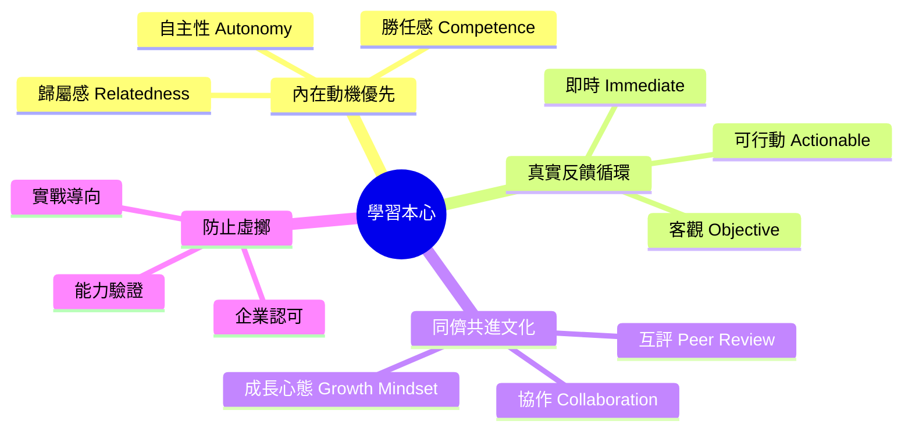

### 教育心理學基礎

```
核心理論依據
━━━━━━━━━━━━━━━━━━━━━━━━━━━━━━━━━

自決理論 (Self-Determination Theory)
  └─ 內在動機來自：自主性、勝任感、歸屬感

認知負荷理論 (Cognitive Load Theory)
  └─ 遊戲化不應增加認知負擔，應減少

社會建構主義 (Social Constructivism)
  └─ 知識在與他人互動中建構

成長心態 (Growth Mindset)
  └─ 能力可透過努力而發展，挫折是學習機會
```

---

## 貳、重構激勵系統

### 舊設計的問題

```
❌ 原設計：
  ├─ 6 級境界 + 6 層等級 + 7 個稱號 + 12 種經驗來源
  ├─ 複雜度高，新手困惑
  ├─ 可能激發外在動機（比較心、虛榮心）
  └─ 風險：用戶為升級而學，非為掌握而學

✅ 新設計哲學：
  ├─ 簡化層級（只保留必需的）
  ├─ 隱藏排行榜（減少比較）
  ├─ 強化反饋（讓學習本身成為獎勵）
  └─ 透明化能力（展示真實成就，非虛擬勳章）
```

### 新激勵系統：「四層反饋」

```mermaid
flowchart TD
    subgraph 第一層：即時反饋
        A1["提交代碼"]
        A2["AI 代碼檢測<br/>2 分鐘內返回"]
        A3["具體建議<br/>示例修正"]
        A1 --> A2 --> A3
    end
    
    subgraph 第二層：同儕反饋
        B1["三人互評<br/>1-2 天內"]
        B2["建設性評論<br/>不只打分"]
        B3["與提交者對話<br/>相互提升"]
        B1 --> B2 --> B3
    end
    
    subgraph 第三層：能力進展
        C1["技能掌握度<br/>0-100%"]
        C2["相對進步<br/>vs 自己上次"]
        C3["習題通過率<br/>可視化圖表"]
        C1 --> C2 --> C3
    end
    
    subgraph 第四層：真實認可
        D1["作品集展示<br/>GitHub 連結"]
        D2["企業實習邀請<br/>真實職位"]
        D3["同儕推薦<br/>招聘信用"]
        D1 --> D2 --> D3
    end
    
    A3 --> B1
    B3 --> C1
    C3 --> D1
    
    style A2 fill:#9f9
    style B2 fill:#9f9
    style C2 fill:#9f9
    style D2 fill:#99f
```

---

## 叁、簡化的技能進度系統

### 放棄「等級」，採用「能力度」

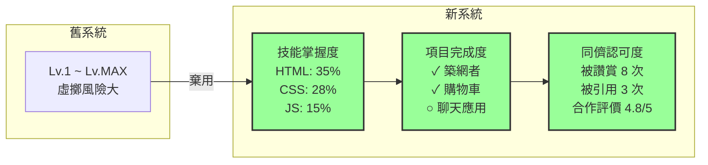

### 核心指標：「三維進度」

不用虛擲的等級系統，改用**三個實在的維度**：

```mermaid
radar
    title 學習者三維進度
    labels 知識掌握度, 項目完成度, 同儕認可度
    data 初級學徒: 25, 20, 15
    data 進階學徒: 50, 45, 40
    data 高級工匠: 75, 70, 65
    data 大師級: 90, 85, 80
```

#### 維度一：知識掌握度（0-100%）

基於實際測試結果：

```
HTML：
  ├─ 基礎語法測試：100%
  ├─ 語義化標記：85%
  └─ 無障礙設計：40%
  → 總體掌握度：75%

CSS：
  ├─ 基礎樣式：90%
  ├─ Flexbox/Grid：65%
  └─ 動畫與過渡：30%
  → 總體掌握度：62%

進度可視化：
  HTML ████████░ 75%
  CSS ██████░░░ 62%
  JS ███░░░░░░ 30%
```

**評估方式：**
- 自動化測試（代碼品質、性能）
- 項目評審（功能完成度）
- 同儕互評（代碼可讀性、風格）

#### 維度二：項目完成度（已完成/進行中/計劃中）

```
已完成（✓）
  ├─ 《築網者》— 個人作品集
  ├─ 《購物車精靈》— 電商前端
  └─ 《天氣預報官》— API 整合

進行中（⏳）
  ├─ 《聊天應用》— 即時通訊（完成度 60%）
  └─ 《博客系統》— 全棧項目（完成度 30%）

計劃中（○）
  ├─ 《影音平台》— 複雜交互
  ├─ 《協作工具》— 團隊項目
  └─ 《開源貢獻》— 真實專案
```

**意義：**
- 不記錄廢棄項目，只計完成
- 完成即代表能力驗證
- 進行中項目展示成長軌跡

#### 維度三：同儕認可度（讚賞值 + 推薦信用）

```
讚賞值（被同儕欣賞的次數）
  ├─ 代碼優雅：5 次
  ├─ 解答有幫助：8 次
  ├─ 教程清晰：3 次
  └─ 協作愉快：4 次
  → 總讚賞：20 次

推薦信用（來自高等級同儕）
  ├─ 可靠合作者：3 人推薦
  ├─ 樂於助人：2 人推薦
  ├─ 代碼品質高：4 人推薦
  └─ 信用評分：4.8/5.0

作用：
  └─ 社群內「被看見」感，非虛擲
```

---

## 肆、重新設計成就系統

### 核心原則：「成就即學習證明」

每個成就都必須回答一個問題：**「這證明了什麼能力？」**

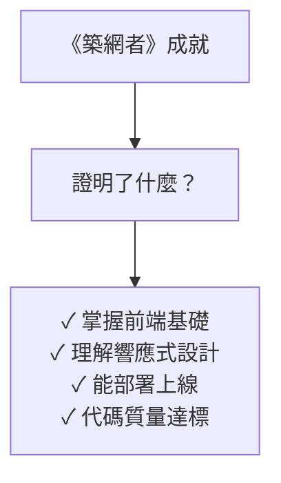

### 新成就分類

不用虛名堆砌，只設計**有教育意義的成就**：

#### 類別 A：技能證明（Skill Badge）

```
【HTML 構建師】
  條件：完成 3 個 HTML 項目，掌握度 ≥ 70%
  證明：理解語義化、無障礙、SEO 最佳實踐
  使用場景：簡歷、GitHub 檔案
  
【Flexbox 大師】
  條件：完成 5 個佈局項目，評審得分 ≥ 4.5/5
  證明：深刻掌握現代 CSS 佈局
  使用場景：設計師招聘
```

#### 類別 B：成長證明（Progress Badge）

```
【從零到一】
  條件：完成第一個完整項目
  意義：跨越心理門檻，建立自信
  設計：可向新手展示「先驅者」足跡
  
【連續學習者】
  條件：連續 30 天每週至少提交 1 個項目
  意義：養成習慣，建立恆心
  設計：展示時間軸而非排名
```

#### 類別 C：協作證明（Collaboration Badge）

```
【良師益友】
  條件：評審 50 次，平均得分 4.5+，被評者反饋正面
  意義：能給予建設性反饋，真正幫助他人
  認可：由同儕投票確認（非系統自動）
  
【協作無間】
  條件：與同一夥伴完成 3+ 個項目，協作評分滿分
  意義：能有效團隊工作，良好溝通
  認可：雙方互相推薦
```

#### 類別 D：知識貢獻（Knowledge Badge）

```
【解答者】
  條件：回答 20 個提問，被標記「有幫助」≥ 15 次
  意義：將知識內化並能清楚表達
  認可：社群評價，非自動系統
  
【教程作者】
  條件：發佈 3 篇教程，累計 50+ 讚賞值
  意義：能系統化整理知識，幫助初學者
  認可：被其他用戶引用、轉載
```

#### 類別 E：挑戰證明（Challenge Badge）

```
【深度挑戰】
  條件：完成「難度 ⭐⭐⭐⭐」的項目
  意義：敢於挑戰，不囿於舒適區
  
【跨界融合】
  條件：一年內掌握 3 個不同領域的技能（各 ≥ 60%）
  意義：開闊視野，複合型人才
```

---

## 伍、強化同儕互評的學習價值

### 問題：當前設計的缺陷

```
❌ 只打分數（4.5/5 分）
  └─ 沒有反饋，無法改進

❌ 互評獲得經驗值
  └─ 鼓勵敷衍評審（快速評完獲經驗）

❌ 評審者隱名
  └─ 無法建立信任和長期關係
```

### 新設計：「對話式互評」

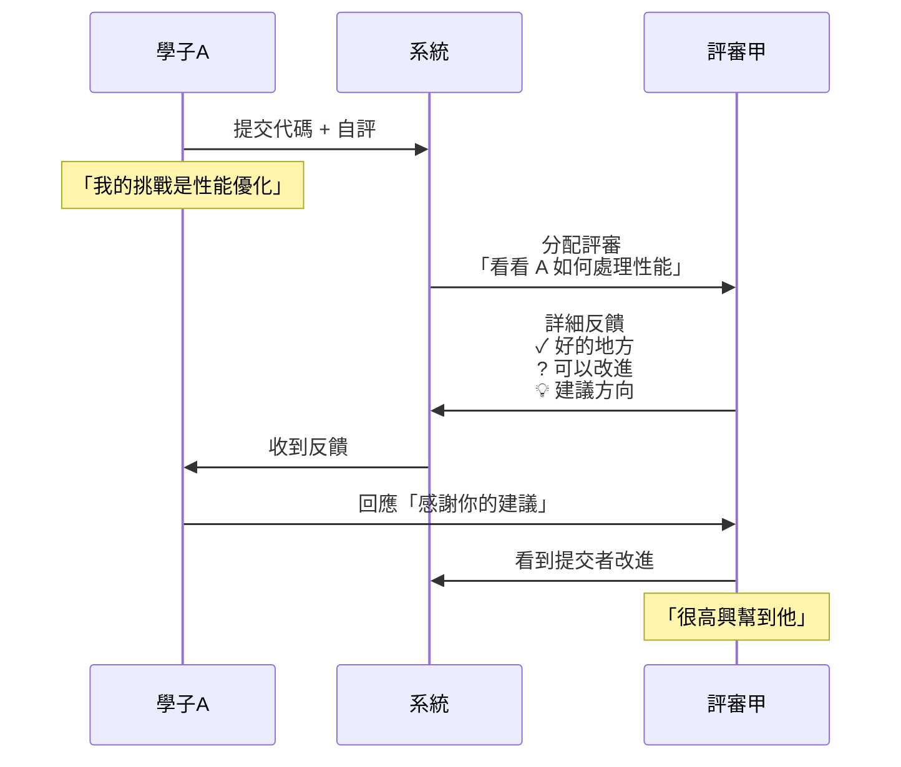

### 互評設計詳解

#### 步驟 1：提交前的「自評」

```
提交代碼時需要填：

【我完成了什麼？】
  ☐ 功能完整
  ☐ 代碼可讀
  ☐ 有測試
  ☐ 部署上線

【我最驕傲的地方】
  "我用 Flexbox 實現了完全響應式設計，無 Media Query"

【我最擔心的地方】
  "性能可能不夠優，動畫有卡頓"

【我希望評審關注】
  ○ 功能是否完整
  ○ 代碼風格
  ○ 性能優化
  ○ 用戶體驗
```

**意義：**
- 促進自我反思
- 評審知道應該關注什麼

#### 步驟 2：同儕評審的「構造化反饋」

```
評審時的表單（非自由填寫）：

【✓ 做得好的地方】（必填，至少 2 項）
  ○ 代碼簡潔易讀
  ○ 邏輯清晰
  ○ 命名有意義
  ○ 其他：_______

【理由和示例】
  "這裡的變數名 `calculateTotalPrice` 很清晰，
   比起 `calc` 或 `getPrice` 要好得多"

─────────────────────────────

【? 可以改進的地方】（非判斷題，純建議）
  "我注意到這個循環在大數據集上可能性能有問題。
   你可以試試用 Map 代替 Array 的 find()，
   時間複雜度會從 O(n²) 降到 O(n)"

【建議改進的優先順序】
  1️⃣ _____________（高優先）
  2️⃣ _____________（中）
  3️⃣ _____________（低，可選）

─────────────────────────────

【💡 啟發性問題】
  "如果要再優化，你想過用什麼方案嗎？"

【推薦資源】（可選）
  "這篇文章講性能優化：[連結]"

─────────────────────────────

【我的署名】
  評審者：_______（非隱名，建立信任）
```

**設計要點：**
- 強制寫出優點（消除純吐槽）
- 建議非命令（尊重學習自主性）
- 署名而非隱名（建立評審者的責任感和信用）

#### 步驟 3：反饋循環

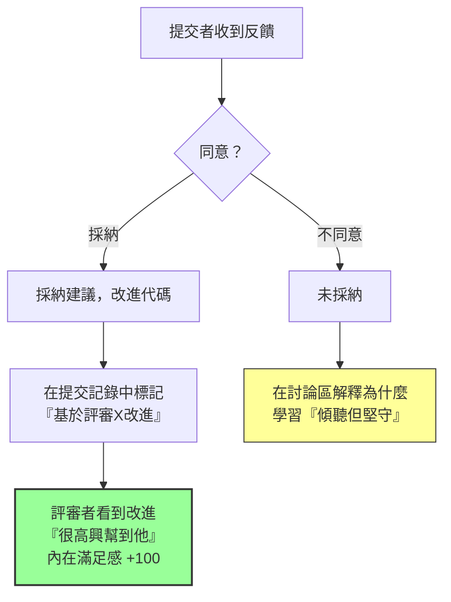

### 互評獎勵機制（非經驗值）

```
❌ 舊設計：評審一次 +20 EXP
✅ 新設計：用「同儕信用」代替

評審者的收穫：
  ├─ 被人看見（通過名字署名）
  ├─ 影響力（看到他人因己建議改進）
  ├─ 學習（評審他人能深化自己理解）
  └─ 信用積累（「良好評審者」的口碑）

系統呈現：
  【評審者檔案】
    評審數：152 次
    平均得分：4.7/5.0（由被評審者打分）
    高影響評審：8 次（提出的建議被採納）
    推薦度：4.8/5.0（同儕投票）
    
    評審風格：
      ├─ 注重代碼風格
      ├─ 深入挖掘原理
      └─ 溫暖建設性
```

---

## 陸、項目副本的真實學習設計

### 核心哲學：「項目≠副本」

```
❌ RPG 副本的特點：
  ├─ 固定路線
  ├─ 已知目標
  ├─ 清晰獎勵
  └─ 快速反饋

✅ 真實項目的特點：
  ├─ 開放式問題
  ├─ 不確定的挑戰
  ├─ 無預定答案
  ├─ 需要探索與試錯
```

### 新設計：「循序漸進的項目庫」

不用「副本」二字，改為**「項目系列」**：

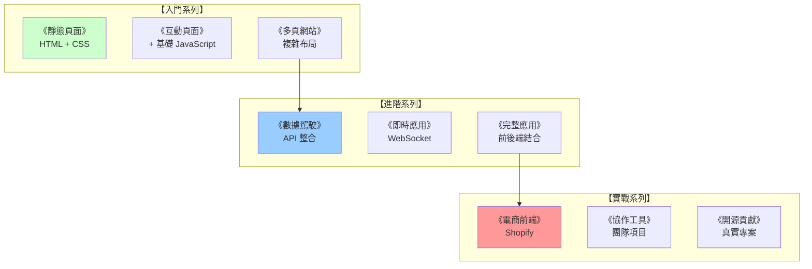

### 每個項目的設計標準

```
【項目信息卡】

《築網者 - 個人作品集網站》

📌 學習目標
  ✓ 掌握響應式設計
  ✓ 理解 CSS Grid
  ✓ 學會部署網站
  ✓ 準備簡歷用作品

⏱️ 建議週期
  初級版本：7 天
  進階版本：14 天
  完整版本：21 天

🎯 評判標準（NOT 通過/失敗，而是維度評分）
  
  維度一：功能完整度（0-100%）
    ☐ 包含必要頁面（home, about, works, contact）
    ☐ 響應式布局（手機/平板/桌面）
    ☐ 無功能 bug
    
  維度二：代碼品質（0-100%）
    ☐ 遵循代碼風格規範
    ☐ 有清晰的註解
    ☐ 結構合理易維護
    
  維度三：使用者體驗（0-100%）
    ☐ 載入速度 ≥ 80/100 (LightHouse)
    ☐ 易用性直觀
    ☐ 視覺設計美觀（不求完美，求有想法）
    
  維度四：創意程度（可選，0-30 分）
    ☐ 獨特的設計風格
    ☐ 有想法的互動
    ☐ 額外的功能創新

📋 參考資源（而非教程，而是啟發）
  - "如何用 CSS Grid 做響應式" [連結]
  - "個人網站設計最佳實踐" [連結]
  - 優秀的作品集範例 [5 個連結]

💬 常見問題
  Q: 我不會設計怎麼辦？
  A: 可以使用設計模板或臨摹優秀作品，目的是學習代碼而非設計
  
  Q: 要從零開始寫還是用框架？
  A: 入門版本手寫，進階版本可試用 Vue/React

🤝 協作機會
  ○ 可邀請 1-2 人組隊
  ○ 分工責任明確（設計、前端、測試）
  ○ 團隊評審時需個人貢獻說明

📚 完成後
  ✓ 代碼放在 GitHub 公開
  ✓ 部署到個人網域
  ✓ 放入簡歷/作品集
  ✓ 分享經驗（寫總結文章）
  ✓ 幫評審他人的類似項目
```

### 項目的分級標準

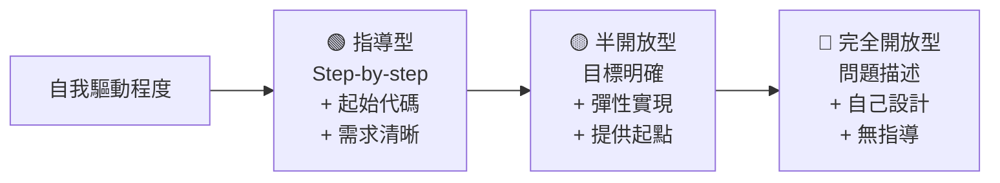

**對應：**
- 🟢 入門系列：指導型
- 🟡 進階系列：半開放型
- 🔴 實戰系列：完全開放型

---

## 柒、打造學習社群（非遊戲公會）

### 放棄「公會」概念，改為「學習小組」

```
❌ 公會的問題：
  ├─ 競爭導向
  ├─ 等級差距
  ├─ 可能演變成小圈子

✅ 學習小組的特點：
  ├─ 協作導向
  ├─ 知識互補
  ├─ 開放包容
```

### 新設計：「興趣駐地」（Interest Hub）

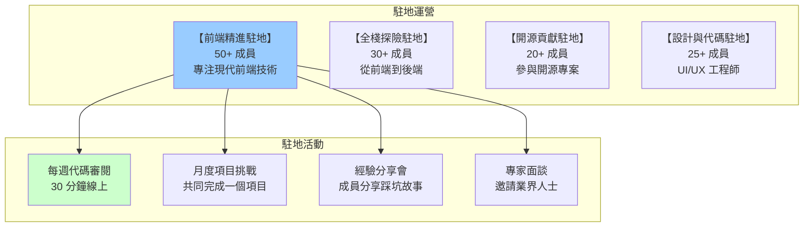

### 駐地的「平等治理」

```
反反反：

❌ 等級制
  "Lv.5 的主持人" vs "Lv.1 的新手"
  → 無形等級制，不利於開放討論

✅ 角色制
  "代碼審閱者"、"經驗分享者"、"新手歡迎官"
  → 根據能力和意願臨時分工，流動性強

運作方式：
  ├─ 每個駐地有「運營委員會」（3-5 人輪值）
  ├─ 任何成員可自願組織活動
  ├─ 定期投票決定駐地方向
  ├─ 基礎規則：尊重、包容、成長心態
  └─ 無「等級」只有「貢獻記錄」
```

---

## 捌、真實能力認證系統

### 超越虛擲：「可信的能力信號」

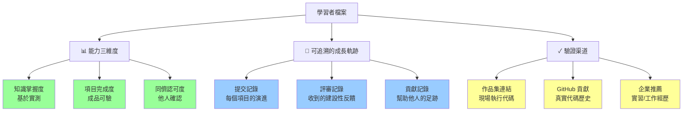

### 公開履歷（Open Profile）

```
每個學習者有一份「公開檔案」：

┌────────────────────────────────┐
│ 小李 | 前端工程師訓練生          │
│ 加入 6 個月 | 北京              │
├────────────────────────────────┤
│                                │
│ 【能力概覽】                   │
│ ████████░░ JavaScript 80%      │
│ ███████░░░ React 70%           │
│ ██████░░░░ Node.js 60%         │
│ ███░░░░░░░ Typescript 30%      │
│                                │
│ 【完成項目】                   │
│ ✓ 築網者 - 個人作品集 (3 個月前)│
│ ✓ 購物車精靈 - 購物車應用      │
│ ✓ 天氣預報官 - API 整合        │
│ ⏳ 聊天應用 - 60% 完成          │
│                                │
│ 【同儕認可】                   │
│ 讚賞值：45 次                  │
│ 推薦信：6 位推薦               │
│ 評審品質：4.8/5.0              │
│                                │
│ 【近期活動】                   │
│ 1 週前：幫 Tom 審閱 React 代碼 │
│ 2 週前：分享「Hooks 最佳實踐」 │
│ 3 週前：完成《聊天應用》v0.1   │
│                                │
│ 【連結】                       │
│ GitHub → tom-portfolio         │
│ 作品集 → tom-works.dev         │
│                                │
└────────────────────────────────┘
```

---

## 玖、反虛擲的三道防線

### 防線一：能力測試

```
不靠「看等級」判斷，而是「真實評估」

❌ "他 Lv.5 所以能力強" → 可能虛擲

✅ "他完成了 5 個項目，同儕評分 4.7，
    讓他做 1 小時的代碼審閱看效果" → 可信
```

### 防線二：項目作品集

```
所有項目都可實際查看：

【築網者 - 個人作品集】
  在線演示：tom-portfolio.dev
  源代碼：github.com/tom/portfolio
  評審記錄：[3 條建設性評論]
  
  ✓ 可看、可驗、可問
```

### 防線三：同儕社群認可

```
最強的認可來自「真實使用者」

❌ "系統說他厲害"

✅ 
  ├─ 6 位同儕推薦他為評審者
  ├─ 他的評論被多人標記「很有幫助」
  ├─ 他寫的教程被轉載 12 次
  └─ 人們主動邀請他合作項目
```

---

## 拾、学习path的个性化建议

### 非強制的「推薦路徑」

不是「你必須這樣學」，而是「可以考慮這樣學」：

```
【推薦路徑示例】

🎯 目標：6 個月成為初級前端工程師

推薦學習序列：
  
  第 1 個月：《HTML + CSS 基礎》
    ├─ 項目：《築網者》作品集網站
    ├─ 時間：4 週
    └─ 目標掌握度：70%+
  
  第 2 個月：《JavaScript 基礎》
    ├─ 項目：《互動頁面》
    ├─ 時間：3 週
    └─ 同時複習前月內容
  
  第 3 個月：《DOM 與事件》
    ├─ 項目：《購物車精靈》
    ├─ 時間：4 週
    └─ 整合 HTML/CSS/JS
  
  第 4-5 個月：《框架基礎》（React OR Vue）
    ├─ 項目：《天氣預報官》API 整合
    └─ 同時開始參與代碼評審
  
  第 6 個月：《進階整合》
    ├─ 項目：小型全棧應用
    └─ 開始貢獻開源專案

⚠️ 注意：
  ├─ 這只是建議，不是規定
  ├─ 可根據興趣和節奏調整
  ├─ 允許迂迴和探索
  └─ 沒有「落後」的概念，只有「不同進度」
```

---

## 拾壹、系統架構（聚焦學習，簡化技術）

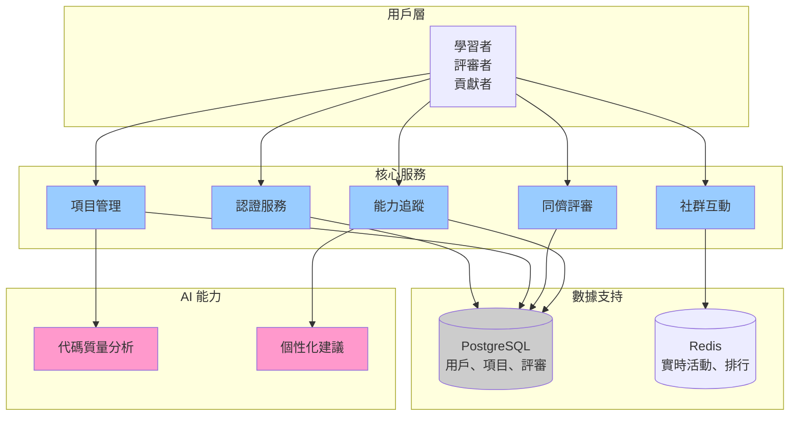

---

## 拾貳、關鍵設計原則總結

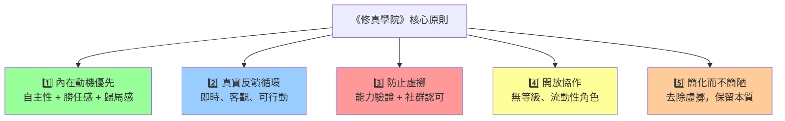

---

## 結語

> 此修訂版設計，放棄商業考量，回歸教育本心。
> 
> 不用虛擲的等級、排行、虛名，取而代之以：
> - **真實的能力追蹤**（三維度進度）
> - **深度的同儕反饋**（對話式互評）
> - **開放的社群協作**（興趣駐地）
> - **可信的成就系統**（每個成就都證明一種能力）
> 
> **核心信念：** 最好的激勵，不是外在的勳章，
> 而是**「被看見、被需要、能幫助他人」**的內在滿足。

---

## 附件：實施優先級

### 第一階段（MVP，3 個月）

必須有：
- [ ] 用戶認證 + 檔案系統
- [ ] 項目提交 + 代碼存儲
- [ ] 同儕互評（簡版）
- [ ] 能力三維度追蹤
- [ ] 基礎社群（討論、Q&A）

可以沒有：
- 企業合作
- 複雜的推薦演算法
- 國際化
- 移動應用

### 第二階段（Beta，3-6 個月）

補充：
- [ ] 對話式互評（完整版）
- [ ] 興趣駐地系統
- [ ] 進階成就系統
- [ ] 個性化推薦路徑
- [ ] 公開檔案和作品集

### 第三階段（1.0+）

可選：
- [ ] 企業實習配對
- [ ] 開源專案整合
- [ ] 直播教學
- [ ] 行動應用

---

**此設計文檔專注於：純粹的學習驅動，摒棄虛擲，回歸教育本心。**
