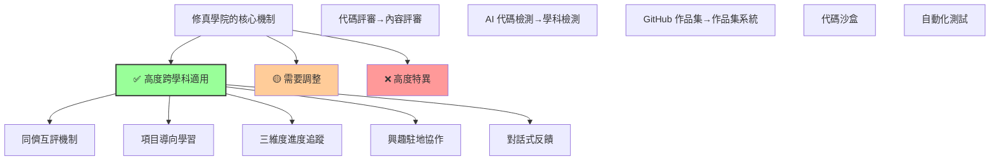
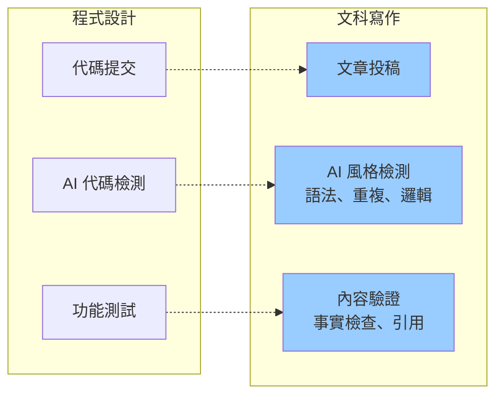
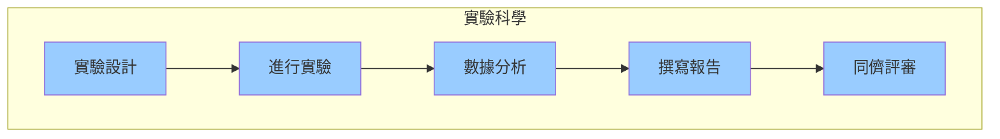
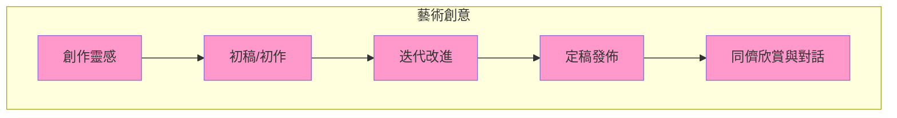
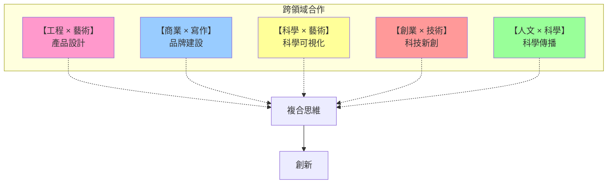
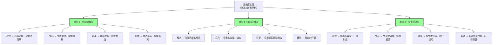
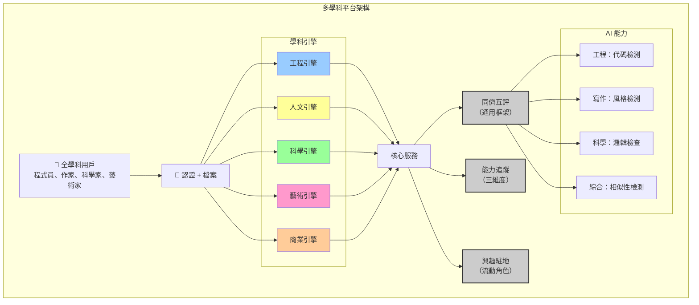
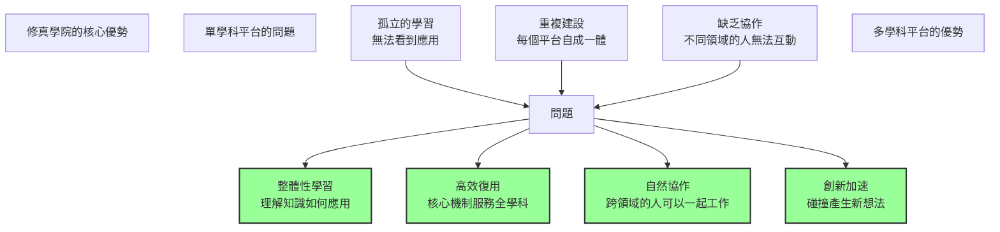
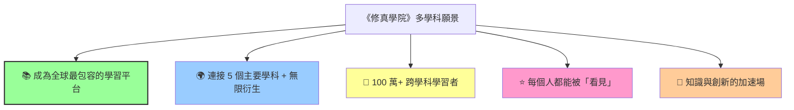

# 《修真學院》跨學科擴張指南

> 「器之道已驗，術之道應驗；法之道可借，天下諸學皆可融。」

---

## 壹、核心機制的普適性分析

### 哪些機制是「跨學科」的？



**結論：** 核心機制 70% 可跨學科適用，30% 需學科特化

---

## 貳、五大學科範疇的延伸設計

### 一、文科與寫作類

#### 適用性評估

```
同儕互評      ✅ 完全適用（同行評審經驗豐富）
項目導向      ✅ 適用（寫作、編輯、研究都是「項目」）
三維度追蹤    ✅ 適用（寫作水平、完成度、影響力）
作品集        ✅ 適用（文章、論文、創意作品）
```

#### 機制調整



#### 項目設計範例

```
【寫作系列項目】

🟢 入門系列

  《評論家初心者》
    ├─ 目標：寫 5 篇書評
    ├─ 評判維度：
    │   • 內容完整度（情節概括、觀點表達）
    │   • 表達清晰度（邏輯、用詞、句式）
    │   • 深度（是否有獨立思考）
    │   • 創意（獨特視角加分）
    └─ 同儕反饋：「哪個觀點讓你印象最深？」

  《論文新手》
    ├─ 目標：完成 1 篇小論文（2000 字）
    ├─ 要求：有論題、文獻、論證、結論
    ├─ 評審標準：邏輯完整度、證據充分度
    └─ 導師指導：提交大綱、初稿、終稿三階段

🟡 進階系列

  《創意寫作工坊》
    ├─ 短篇小說創作
    ├─ 同儕評審：故事性、人物塑造、對話自然度
    └─ 月度主題挑戰

  《新聞寫作實踐》
    ├─ 採訪一個人，寫成新聞稿
    ├─ 要素：Who/What/When/Where/Why
    ├─ 編輯反饋：新聞價值、寫作手法
    └─ 發布：校內刊物或部落格

🔴 實戰系列

  《獨立評論者》
    ├─ 在公開平台發佈評論
    ├─ 目標：累計 100+ 讀者互動
    ├─ 評審：社群反饋、引用情況
    └─ 進階：邀請專業編輯點評

  《研究論文發表》
    ├─ 完成學術論文並投稿
    ├─ 同儕評審（同行評審制）
    └─ 發表或收到修改意見
```

#### 同儕互評的特化

```
【文科互評範本】

提交內容：《平凡的世界》書評

【✓ 做得好的地方】（必填）
  
  "你對主角心理的分析很敏銳，特別是這句：
   『他在現實與理想之間搖擺，正是我們這代人的寫照』
   這不只是總結，而是有個人思考的評論。"

─────────────────────────────

【? 可以改進的地方】

  "第二段有點冗長，對 Louis 的背景介紹占了太多篇幅。
   其實可以用一句帶過，留出空間討論他的內心衝突。"

【具體例子】
  原文：「Louis 出生於農村，後來到城市工作...」（250 字）
  
  改進建議：「Louis 的農村出身與城市夢想形成反差...」（一句帶過）

─────────────────────────────

【💡 啟發性問題】

  "我對這個觀點很感興趣：你認為這部作品對當代社會有什麼
   現實意義嗎？是否可以補充一個例子來支撐這個觀點？"

【推薦延伸】
  - 對比討論：《活著》中的類似主題
  - 深度思考：階層流動與文學表現
```

---

### 二、科學與實驗類

#### 適用性評估

```
同儕互評      ✅ 完全適用（科研同行評審傳統）
項目導向      ✅ 適用（實驗報告、研究論文）
三維度追蹤    ✅ 適用（理論理解、實驗技能、論文產出）
作品集        ✅ 適用（實驗數據、論文、海報）
```

#### 特化設計



#### 項目設計範例

```
【實驗科學系列】

🟢 入門：《實驗新手》

  《水質測試實驗》
    ├─ 學習目標：掌握 pH、硬度、污染物檢測
    ├─ 實驗步驟：提供標準流程（5 步）
    ├─ 數據集：測試 3 個樣本
    └─ 報告要求：
        • 目的（為什麼做）
        • 方法（怎麼做）
        • 結果（數據表格）
        • 分析（數據說明了什麼）
    
    評審標準（同儕互評）：
      維度一：實驗執行正確度（80%）
      維度二：報告清晰度（70%）
      維度三：數據解釋合理度（65%）
      維度四：創意延伸（如自建檢測工具）

🟡 進階：《獨立研究》

  《某校園植物物種多樣性調查》
    ├─ 完全由學生設計
    ├─ 提交：研究計劃 → 實地調查 → 數據 → 報告
    ├─ 時間：4 週
    ├─ 同儕評審：
    │   • 研究設計是否科學
    │   • 數據收集方法是否規範
    │   • 統計分析是否恰當
    │   • 結論是否有根據
    └─ 可邀請教授複審

🔴 實戰：《原創研究發表》

  《自選課題研究論文》
    ├─ 時間：完成時限 3-6 個月
    ├─ 投稿：科學期刊（如中學生科技期刊）
    ├─ 同行評審：真實編輯與審稿人
    ├─ 可能結果：
    │   ✓ 發表
    │   ✓ 修改後發表
    │   ○ 需重大改進
    │   ○ 不接受
    └─ 所有反饋都成為學習機會
```

#### 科學專用功能

```
【AI 輔助的科學驗證】

提交實驗報告後，系統檢測：

✓ 邏輯檢查
  ├─ 是否有明確的研究問題
  ├─ 方法是否能驗證假設
  └─ 結論是否有數據支撐

✓ 數據檢查
  ├─ 異常值偵測
  ├─ 統計方法適切性檢查
  └─ 重複計算驗證

✓ 文獻檢查
  ├─ 引用格式驗證
  ├─ 核查是否正確引用
  └─ 檢測是否遺漏重要文獻
```

---

### 三、藝術與創意類

#### 適用性評估

```
同儕互評      ✅ 完全適用（但需要欣賞而非判斷）
項目導向      ✅ 適用（作品就是項目）
三維度追蹤    🟡 需調整（技法、完成度、社群共鳴）
作品集        ✅ 完全適用（藝術平台展示）
```

#### 特化設計



#### 項目設計範例

```
【藝術創意系列】

🟢 入門：《創意基礎》

  《色彩與構圖研究》
    ├─ 創作 5 張作品，每張探索一個配色方案
    ├─ 可用媒介：數位、油畫、混合媒體
    ├─ 同儕回饋（非批評，而是對話）：
    │   • "這個配色讓我感受到什麼？"
    │   • "哪裡吸引了我的視線？"
    │   • "如果這是為書封設計，會適合嗎？"
    │   • "這讓你想起什麼音樂？"
    └─ 創作者反思：解釋設計意圖

  《敘事漫畫 (4 格)》
    ├─ 需要：故事、人物、視覺風格
    ├─ 同儕互評維度：
    │   • 故事完整度
    │   • 人物性格表現
    │   • 視覺構圖
    │   • 節奏感（每格的銜接）
    └─ 對話點：「這個角色的下一步會怎樣？」

🟡 進階：《風格探索》

  《個人攝影系列：主題探索》
    ├─ 選定主題（如「城市孤獨」、「時間流逝」）
    ├─ 拍攝 20-30 張照片
    ├─ 精選 10-15 張組成作品集
    ├─ 同儕對話：
    │   ✓ "為什麼選這張作為開頭？"
    │   ✓ "這系列想傳達什麼？"
    │   ✓ "最難的拍攝是哪一張？"
    └─ 創作者呈現：創意故事

  《插畫人物設計》
    ├─ 創作 5 個角色的完整設定
    ├─ 包括：基礎角色、動作表現、情緒狀態
    ├─ 同儕互評：
    │   • 角色設計的獨特性
    │   • 性格是否清晰傳達
    │   • 技法熟練度
    │   • 是否有商業潛力
    └─ 進階：為故事或遊戲設計角色

🔴 實戰：《創意產業協作》

  《品牌視覺系統設計》
    ├─ 與真實小企業合作
    ├─ 設計：LOGO、色彩方案、字體、應用
    ├─ 時間：8-12 週
    ├─ 客戶反饋：反覆迭代
    ├─ 完成後：
    │   ✓ 用於企業品牌
    │   ✓ 作品集重量級作品
    │   ✓ 可能轉化為實習機會
    └─ 同儕評審：業界設計師點評

  《創意策展與展覽》
    ├─ 組織主題展覽（線上或線下）
    ├─ 邀請 20-30 位藝術家參展
    ├─ 創作策展說明文字
    ├─ 組織開幕活動
    └─ 結果：
        • 參展者學會「被看見」的感覺
        • 策展人學會「組織與溝通」
        • 社群凝聚力增強
```

#### 藝術專用互評機制

```
【藝術作品的「欣賞式評審」】

❌ 不用打分或判斷「好壞」

✅ 改用「對話式欣賞」

【我看到了什麼】
  "這件作品讓我注意到光影的對比，
   特別是右上角的高光與陰影創造了深度感。"

【我感受到了什麼】
  "看這部分時，我感到一種寧靜的孤獨感。
   可能是因為色調偏冷，加上構圖留出很多空白。"

【我的好奇心】
  "我想知道你為什麼選擇這個視角？
   從下往上看與從上往下看會有完全不同的感受。"

【我的啟發】
  "你這個技法給了我靈感，我想在下一件作品中嘗試。"

【我的推薦】
  "我覺得這件作品特別適合用於書籍封面。
   有沒有考慮投稿設計獎？"
```

---

### 四、商業與創業類

#### 適用性評估

```
同儕互評      ✅ 完全適用（團隊協作、投資方評審）
項目導向      ✅ 完全適用（商業計劃、產品開發）
三維度追蹤    ✅ 適用（商業理論、執行能力、市場驗證）
作品集        ✅ 適用（案例研究、財務報表）
```

#### 項目設計範例

```
【創業與商業系列】

🟢 入門：《商業基礎》

  《商業計劃書撰寫》
    ├─ 概念：虛構創業
    ├─ 需要：行業分析、商業模式、財務預測、營銷策略
    ├─ 團隊規模：1-3 人
    ├─ 評審標準：
    │   • 市場分析的深度
    │   • 商業模式的可行性
    │   • 財務邏輯的合理性
    │   • 風險識別與應對
    │   • 表達的說服力
    └─ 同儕評審：「這個計劃最大的風險在哪？」

  《案例分析：一家成功的新創公司》
    ├─ 選擇一家感興趣的公司
    ├─ 分析：如何從 0 到 1、市場定位、關鍵決策
    ├─ 撰寫報告（3000 字）
    ├─ 同儕討論：「他們為何成功？我們能學到什麼？」
    └─ 可邀請業界人士參與討論

🟡 進階：《實踐驗證》

  《小規模產品開發與銷售》
    ├─ 目標：實際開發並銷售一件產品
    ├─ 可能性：手工藝品、數位產品、服務
    ├─ 時間軸：
    │   • 第 1 週：產品定義、目標用戶分析
    │   • 第 2-4 週：製作/開發
    │   • 第 5 週：包裝、定價、行銷
    │   • 第 6-8 週：銷售與反饋收集
    │   • 第 9-10 週：迭代改進
    ├─ 評審指標：
    │   • 是否有實際銷售
    │   • 客戶反饋是否正面
    │   • 創業者是否根據反饋改進
    │   • 是否有可持續性
    └─ 同儕評審：「下一步應該怎麼做？」

  《社群商業運營》
    ├─ 建立微社群（50-200 人）
    ├─ 提供某種價值（內容、產品、服務）
    ├─ 時間：3 個月
    ├─ 評審標準：
    │   • 社群的凝聚力
    │   • 用戶留存率
    │   • 是否產生口碑傳播
    │   • 社群的健康度（非騙局）
    └─ 可能演變為真實業務

🔴 實戰：《企業合作項目》

  《真實創業挑戰賽》
    ├─ 與孵化器合作
    ├─ 團隊提交計劃書
    ├─ 投資方真實評審
    ├─ 獲選的計劃獲得種子資金（如 $5K-20K）
    ├─ 3-6 個月內執行
    ├─ 定期向投資方彙報進度
    └─ 結果：
        ✓ 有些項目真實存活
        ✓ 參賽者學到真實商業課程
        ✓ 可能轉化為正式創業

  《企業實習與創新挑戰》
    ├─ 與公司合作
    ├─ 給予真實業務挑戰
    ├─ 學生團隊提交解決方案
    ├─ 公司真實評估方案價值
    ├─ 優秀方案可能被採用
    └─ 參與者同時學習與創造價值
```

---

### 五、跨學科融合類

#### 「交叉駐地」概念



#### 跨學科項目範例

```
【交叉駐地項目】

🤝 工程 × 藝術：《智慧家居美學設計》

  參與者：
    • 軟體工程師 1-2 名
    • 設計師 1-2 名
    • 產品經理 1 名

  任務：
    • 工程師負責功能實現（物聯網、App）
    • 設計師負責使用者介面與工業設計
    • 產品經理協調與驗收
    
  同儕互評維度：
    • 技術可行性（工程師評）
    • 美學表達（設計師評）
    • 易用性（產品經理評）
    • 團隊協作品質
  
  成果：
    • 可執行的原型機
    • 可獲獎的設計作品集
    • 創業潛力項目

─────────────────────────────

🤝 科學 × 傳播：《科普視頻製作》

  參與者：
    • 科學領域專家 1-2 名
    • 影像製作師 1-2 名
    • 編劇 1 名

  任務：
    • 科學家提供準確的科學內容
    • 製作師把複雜概念轉化為視覺故事
    • 編劇確保敘事吸引人

  同儕互評維度：
    • 科學準確性
    • 視覺吸引力
    • 敘事有趣度
    • 目標受眾理解度

  成果：
    • 發佈在 YouTube 等平台
    • 累計 10 萬+ 觀看可獲「傳播大使」成就
    • 真實社會影響

─────────────────────────────

🤝 商業 × 設計 × 工程：《社會企業孵化》

  概念：
    • 設計出解決真實社會問題的產品
    • 商業模式讓其可持續
    • 技術實現使其可用

  案例可能性：
    • 環保鞋履回收系統
    • 偏遠地區遠端教育平台
    • 共享二手物品市場

  評審標準：
    • 社會問題的真實性
    • 解決方案的創新性
    • 商業模式的可持續性
    • 技術的可實現性
    • 團隊執行能力

  最終結果：
    ○ 可能成為真實社企
    ○ 獲得社企投資
    ○ 參與者學到跨領域整合能力
```

---

## 叁、通用的機制框架

### 跨學科通用的「三維度進度模型」



### 跨學科通用的「同儕互評框架」

```
【任何學科都適用的互評結構】

提交內容：[學科特定的作品]

【✓ 做得好的地方】（必填，至少 2 項）
  
  [具體例子與讚賞]

─────────────────────

【? 可以改進的地方】（純建議，非判斷）
  
  [具體問題 + 改進方向]

─────────────────────

【💡 啟發性問題】
  
  [開放式問題，促進思考]

─────────────────────

【推薦資源 / 想法】
  
  [補充資源或合作機會]
```

### 跨學科通用的「五類成就系統」

```mermaid
graph TD
    A["五類成就<br/>（跨學科通用）"]
    
    B["🛠️ 技能證明<br/>掌握了核心技法"]
    B1["程式 → JavaScript 大師"]
    B2["寫作 → 評論家"]
    B3["科學 → 實驗設計師"]
    B4["藝術 → 色彩大師"]
    
    C["📈 成長證明<br/>跨越心理門檻"]
    C1["程式 → 完成第一個應用"]
    C2["寫作 → 發表第一篇文章"]
    C3["科學 → 完成第一份研究"]
    C4["藝術 → 完成第一件作品"]
    
    D["🤝 協作證明<br/>能有效幫助他人"]
    D1["程式 → 優秀代碼審閱者"]
    D2["寫作 → 編輯顧問"]
    D3["科學 → 實驗導師"]
    D4["藝術 → 策展人"]
    
    E["📚 貢獻證明<br/>將知識系統化分享"]
    E1["程式 → 教程作者"]
    E2["寫作 → 論文作者"]
    E3["科學 → 科普作者"]
    E4["藝術 → 藝術評論家"]
    
    F["⚡ 挑戰證明<br/>突破舒適區"]
    F1["程式 → 完成難度 ⭐⭐⭐⭐⭐ 項目"]
    F2["寫作 → 跨越自己的風格束縛"]
    F3["科學 → 自主設計完整研究"]
    F4["藝術 → 跨領域融合創作"]
    
    A --> B --> B1 & B2 & B3 & B4
    A --> C --> C1 & C2 & C3 & C4
    A --> D --> D1 & D2 & D3 & D4
    A --> E --> E1 & E2 & E3 & E4
    A --> F --> F1 & F2 & F3 & F4
```



---

## 肆、系統架構的通用設計



---

## 伍、擴張的分階段路線圖

### 階段一：工程+通用核心（第 1-3 個月）

```
已有：修真學院（程式設計版）

目標：建立可擴張的核心引擎

✅ 完成：
  ├─ 通用用戶檔案系統
  ├─ 通用同儕互評框架
  ├─ 通用三維度追蹤
  ├─ 通用興趣駐地系統
  └─ 工程領域的完整實現
```

### 階段二：文科 + 科學（第 4-6 個月）

```
擴張：文科與科學領域

新增功能：
  ├─ 文科學科引擎
  │   ├─ 文章提交系統
  │   ├─ 文獻管理工具
  │   └─ AI 文本檢測（語法、重複、邏輯）
  │
  ├─ 科學學科引擎
  │   ├─ 實驗報告模板
  │   ├─ 數據分析工具
  │   └─ AI 數據驗證（異常值、統計）
  │
  └─ 跨學科：第一波協作項目
      (工程 × 文科、科學 × 藝術)
```

### 階段三：藝術 + 商業（第 7-9 個月）

```
擴張：藝術與商業領域

新增功能：
  ├─ 藝術學科引擎
  │   ├─ 作品上傳與展示
  │   ├─ 欣賞式評審系統
  │   └─ 視覺相似性檢測 AI
  │
  ├─ 商業學科引擎
  │   ├─ 商業計劃書模板
  │   ├─ 財務分析工具
  │   └─ 市場數據整合
  │
  └─ 完整的五領域協作生態
```

### 階段四：生態完善（第 10+ 個月）

```
完善多學科平台

新增：
  ├─ 跨學科推薦引擎
  ├─ 學科融合的創新項目
  ├─ 行業專家網絡
  ├─ 企業合作生態
  └─ 國際化擴張
```

---

## 陸、跨學科的獨特優勢

### 為什麼跨學科很重要？

```
【人類真實的挑戰都是跨學科的】

案例一：城市規劃
  ├─ 需要：建築師（藝術）
  ├─ 需要：工程師（技術）
  ├─ 需要：經濟學家（商業）
  ├─ 需要：環保科學家（科學）
  └─ 需要：社會學家（人文）

案例二：產品設計
  ├─ 需要：工程師（技術可行性）
  ├─ 需要：設計師（美學）
  ├─ 需要：心理學家（用戶體驗）
  └─ 需要：商人（商業可行性）

案例三：疾病防控
  ├─ 需要：醫學家（科學）
  ├─ 需要：傳播專家（寫作）
  ├─ 需要：技術人員（信息系統）
  ├─ 需要：政策制定者（商業/政治）
  └─ 需要：社會學家（人文）
```

### 修真學院的「跨學科優勢」



---

## 柒、可能的衍生應用

### 教育機構合作

```
【大學】
  └─ 修真學院作為教學助手平台
      ├─ 課堂評審系統
      ├─ 學生檔案系統
      ├─ 跨系課程協作
      └─ 畢業作品展示

【高中/初中】
  └─ 興趣選修課平台
      ├─ 學生自主選課
      ├─ 項目式學習
      ├─ 成績透視化
      └─ 升學輔助

【職業培訓】
  └─ 行業技能認證平台
      ├─ 實戰項目導向
      ├─ 行業導師評審
      ├─ 就業對接
      └─ 終身學習檔案
```

### 社區應用

```
【社區學習中心】
  └─ 本地興趣駐地
      ├─ 書法愛好者駐地
      ├─ 編程自學者駐地
      ├─ 寫作創意社
      ├─ 攝影愛好者
      └─ 定期線下聚會

【老年大學】
  └─ 銀髮族重新學習
      ├─ 書畫、音樂、手工
      ├─ 友好的介面設計
      ├─ 同齡人社群
      └─ 代代相傳的智慧
```

### 企業應用

```
【員工持續發展】
  └─ 內部學習平台
      ├─ 跨部門技能培養
      ├─ 導師制度
      ├─ 創新項目孵化
      └─ 員工檔案管理

【合作與研發】
  └─ 外部創新協作
      ├─ 創意競賽平台
      ├─ 眾包設計
      ├─ 用戶共創
      └─ 學生實習配對
```

---

## 捌、可能的挑戰與應對

### 挑戰一：學科差異性大

```
問題：
  ├─ 程式有「正確答案」
  ├─ 藝術沒有「對錯」
  ├─ 文科是「見仁見智」
  └─ 科學需「嚴謹驗證」

應對方案：
  ✅ 設計學科特化的評審標準
  ✅ 訓練學科內評審者
  ✅ 允許學科間差異（不強求一致）
  ✅ 強化「欣賞」而非「判斷」的文化
```

### 挑戰二：評審品質難以保證

```
問題：
  ├─ 如何確保文科評審者有品味？
  ├─ 如何確保科學評審者有嚴謹度？
  ├─ 跨學科評審時如何避免無關評論？

應對方案：
  ✅ 評審者認證制度（每學科設置）
  ✅ 評審反饋的「有用性投票」
  ✅ 低評分評審者的權重逐漸降低
  ✅ 高評分評審者的推薦度提高
```

### 挑戰三：社群碎片化

```
問題：
  ├─ 程式社群可能 10K+ 人
  ├─ 冷門學科可能只有 50 人
  ├─ 如何維持活力？

應對方案：
  ✅ 小駐地（51 人上限）保證親密度
  ✅ 跨駐地活動（5-10 個駐地聯合）
  ✅ 線下聚會補充線上互動
  ✅ 大型年度盛會（全學科集聚）
```

---

## 玖、最終願景



### 一句話的願景

> **「修真學院不是一個編程平台，也不只是一個教育平台，**  
> **而是一個『知識社群基礎設施』，**  
> **讓不同領域的學習者都能找到『被看見、被認可、能幫助他人』的感受。」**

---

## 拾、實施建議

### 優先級排序

```
P0（必須）
  ① 完成工程領域（已有）
  ② 提煉通用核心（同儕互評、三維度、駐地）
  ③ 驗證通用性（選 1 個新學科測試）

P1（重要）
  ④ 擴張至 5 個主要學科
  ⑤ 建立跨學科協作機制
  ⑥ 訓練跨學科的同儕評審者

P2（可選）
  ⑦ 企業/機構集成
  ⑧ 國際化擴張
  ⑨ 行動應用開發
```

### 快速驗證方案

```
【三月快速測試計畫】

目標：驗證核心機制在其他學科的適用性

方案：
  ├─ 招募 50 位「寫作學習者」
  ├─ 使用現有平台框架
  ├─ 修改：AI 檢測、評審模板、項目設計
  ├─ 運營 3 個月
  └─ 收集反饋

指標：
  ✓ 用戶留存率 ≥ 50%
  ✓ 平均週活 ≥ 60%
  ✓ 同儕互評品質平均 ≥ 4/5
  ✓ 是否有「跨領域合作」萌芽

結論：
  若成功 → 全面擴張至其他學科
  若失敗 → 調整機制後再試
```

---

## 結語

> 修真學院起於編程，但其精神遠超編程。
> 
> 「同儕互評、三維進度、興趣駐地、對話反饋」
> 這些機制，不問學科，只問人心。
> 
> 當一位書法家、一位物理學家、一位創業者、一位藝術家
> 都能在同一個平台上被看見、被認可、能幫助他人，
> 這就是真正的「修真學院」——
> 
> **不是「教育」平台，而是「賦能」平台；**  
> **不是「排名」系統，而是「協作」系統；**  
> **不是「虛擲」遊戲，而是「真實」社群。**

---

**此擴張指南專注於：通用機制、跨學科適配、實踐驗證。**
