# 🎮 未來學習型態設計書
## 「修真學院」— 融 School 42 法門與 RPG 技能樹於一爐

> 「學如逆水行舟，不進則退；修如登山臨淵，步步為營。」

---

## 壹、核心理念

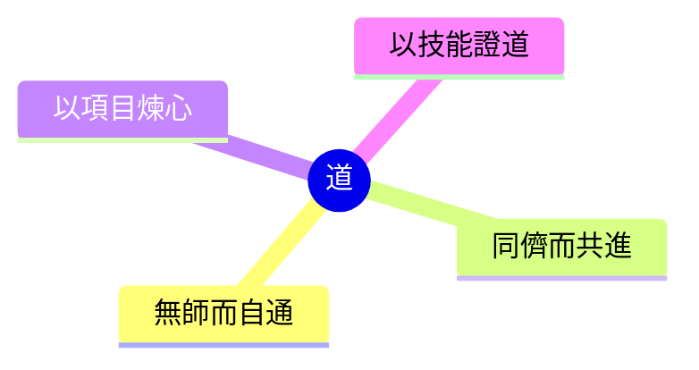

| School 42 精髓 | RPG 技能樹要素 | 融合之法 |
|----------------|----------------|----------|
| 無師制 | 自由加點 | 學子自選修煉路徑 |
| 同儕學習 | 公會組隊 | 結伴闖關、互評互助 |
| 專案導向 | 任務副本 | 以實戰項目為升級之道 |
| Piscine 試煉 | 新手村試煉 | 入門關卡篩選心志 |
| 等級制度 | 經驗值系統 | 量化成長、可視進度 |

---

## 貳、技能樹架構

### 總覽

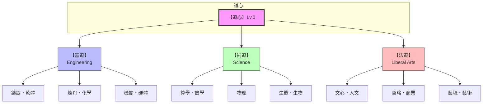

### 以「鑄器道・軟體」為例

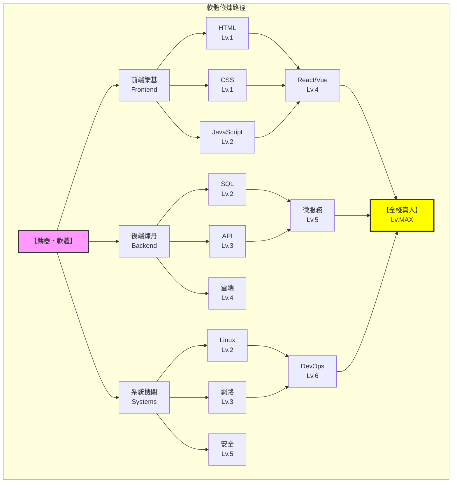

---

## 參、修煉機制

### 一、入門試煉「泳池」(Piscine)

```mermaid
flowchart LR
    subgraph 泳池試煉【28日】
        D1[Day 1-7<br/>基礎語法<br/>獨自摸索]
        D2[Day 8-14<br/>小型項目<br/>同儕互評]
        D3[Day 15-28<br/>團隊副本<br/>存亡之戰]
        
        D1 --> D2 --> D3
    end
    
    D3 -->|通過| PASS[🎉 獲「學徒」身份<br/>正式入道]
    D3 -->|未通過| FAIL[⏳ 三月後可再試]
    
    style PASS fill:#9f9,stroke:#333
    style FAIL fill:#f99,stroke:#333
```

### 二、經驗值與等級

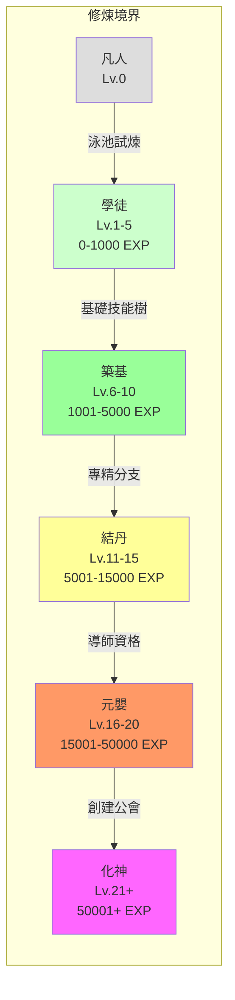

### 三、經驗獲取之道

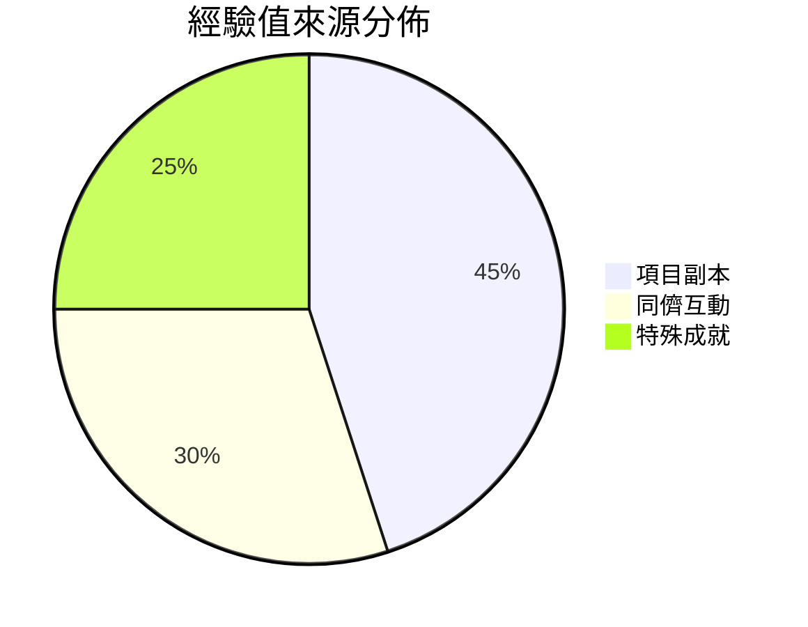

| 類別 | 行為 | 經驗值 |
|------|------|--------|
| **項目副本** | 完成項目 | +100 |
| | 優秀評價 | +50 |
| | 團隊副本 | +200 |
| | 挑戰副本 | +300 |
| **同儕互動** | 評審他人 | +20 |
| | 被評優秀 | +30 |
| | 解答提問 | +15 |
| | 組隊加成 | ×1.5 |
| **特殊成就** | 首次通關 | +50 |
| | 連續簽到 | +10/日 |
| | 技能滿級 | +500 |
| | 跨界融合 | +1000 |

---

## 肆、項目副本系統

### 副本類型

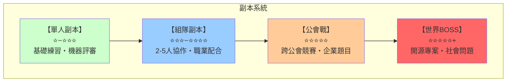

### 副本範例：「築網者」

```mermaid
flowchart TD
    subgraph 副本：築網者
        INFO[📋 副本信息<br/>前置：HTML Lv2, CSS Lv2, JS Lv1<br/>等級：築基期 Lv.6+<br/>時限：14日]
        
        TASK[📌 任務目標]
        T1[☐ 響應式設計]
        T2[☐ 至少三個頁面]
        T3[☐ 動態效果]
        T4[☐ 部署上線]
        
        REVIEW[🔍 評審方式<br/>三位同儕互評 + AI 代碼檢測]
        
        REWARD[🎁 獎勵]
        R1[基礎：+150 EXP]
        R2[優秀：+50 EXP +「築網者」稱號]
        R3[卓越：+100 EXP + 名人堂展示]
        
        INFO --> TASK
        TASK --> T1 & T2 & T3 & T4
        T1 & T2 & T3 & T4 --> REVIEW
        REVIEW --> REWARD
        REWARD --> R1 & R2 & R3
    end
```

---

## 伍、同儕互評機制

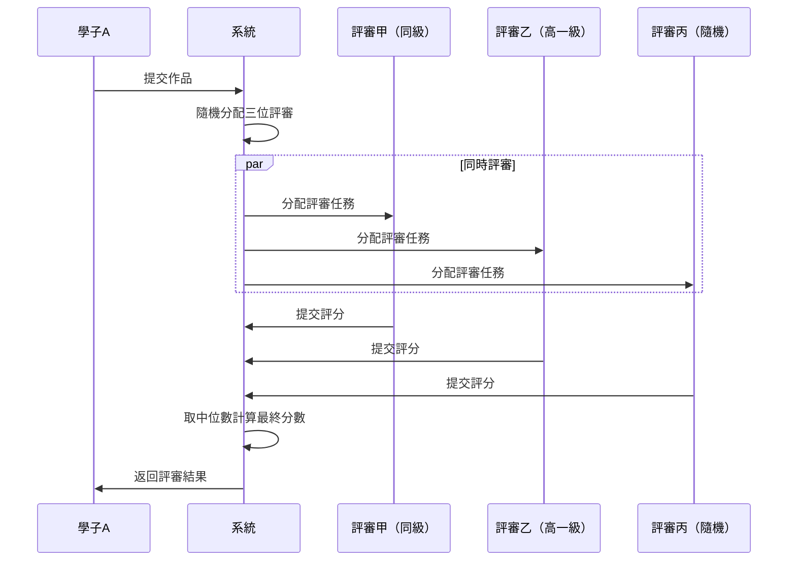

### 評審獎懲

| 行為 | 結果 |
|------|------|
| 認真評審、給出建設性意見 | +20 EXP |
| 評審結果與最終一致 | +10 EXP（準確獎勵）|
| 敷衍評審 | -10 EXP、降低評審權重 |
| 惡意評審 | 禁止評審資格 30 日 |

---

## 陸、公會系統

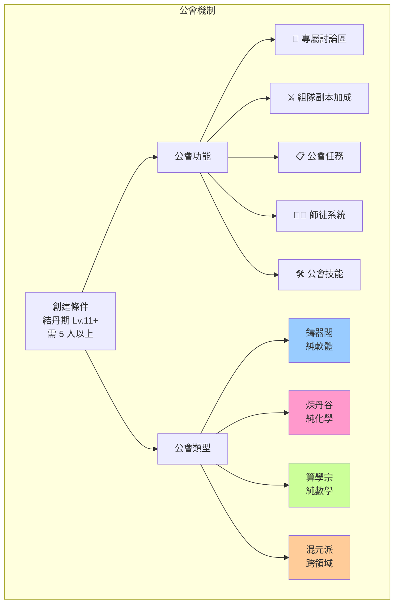

---

## 柒、成就與稱號

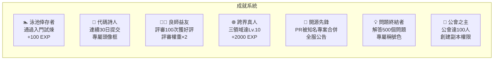

---

## 捌、技術實現架構

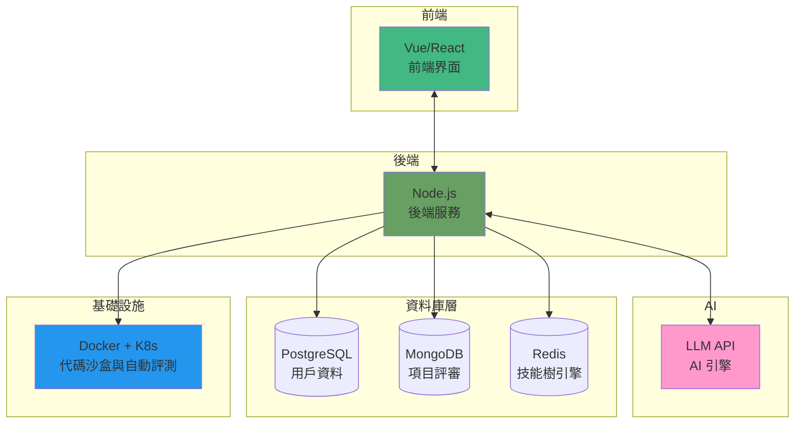

---

## 玖、與傳統教育之比較

```mermaid
radar
    title 學習模式比較
    labels 教師依賴度, 自主程度, 協作強度, 反饋速度, 遊戲化程度, 實戰導向
    data 傳統學校: 90, 20, 30, 20, 10, 30
    data School_42: 10, 90, 90, 80, 40, 90
    data 修真學院: 10, 85, 95, 95, 95, 90
```

| 維度 | 傳統學校 | School 42 | 修真學院（本設計） |
|------|----------|-----------|-------------------|
| 教師 | 必需 | 無 | 無，但有「導師」玩家 |
| 課表 | 固定 | 自由 | 自由 + 推薦路徑 |
| 評量 | 考試 | 同儕互評 | 同儕 + AI 雙軌 |
| 動機 | 外在（分數）| 內在（興趣）| 遊戲化（成就感）|
| 進度 | 統一 | 自主 | 自主 + 可視化 |
| 協作 | 少 | 核心 | 核心 + 公會強化 |
| 反饋 | 延遲 | 即時 | 即時 + 量化 |

---

## 拾、未來展望

### 階段性目標

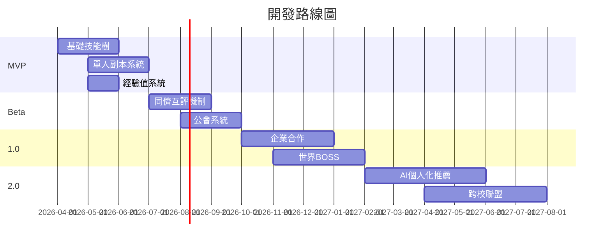

### 商業模式

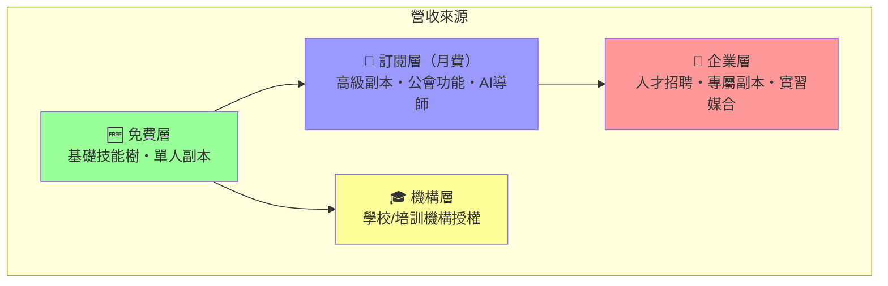

---

## 結語

> 此設計取 School 42「無師自通、同儕共進」之精神，
> 融 RPG 技能樹「可視成長、成就驅動」之妙法，
> 冀望打造一學習型態，使學子如遊戲般沉浸，如修仙般精進。
>
> **「道可道，非常道；學可學，非常學。」**

---

## 授權

MIT License

## 作者

由 AI 助手協助設計，2026年3月

## 參考資料

- [School 42 Official](https://42.fr/)
- [Peer-to-Peer Learning](https://en.wikipedia.org/wiki/Peer_learning)
- [Gamification in Education](https://en.wikipedia.org/wiki/Gamification_of_learning)
- [MermaidJS Documentation](https://mermaid.js.org/)
