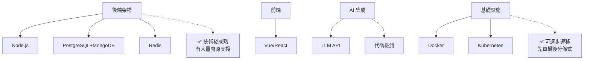
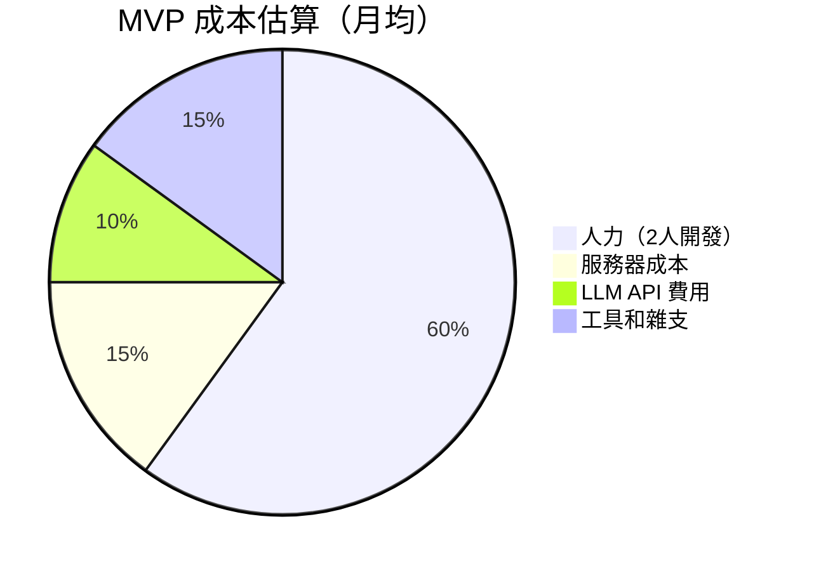
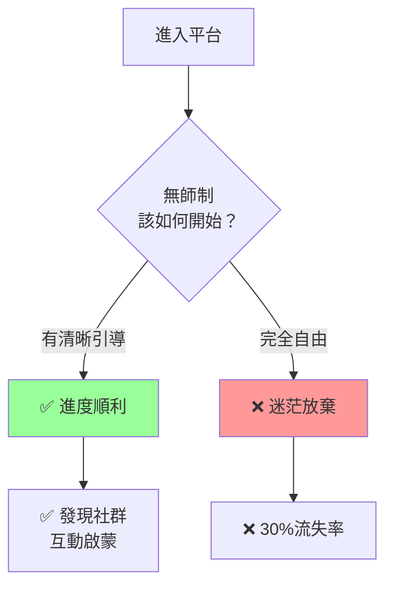
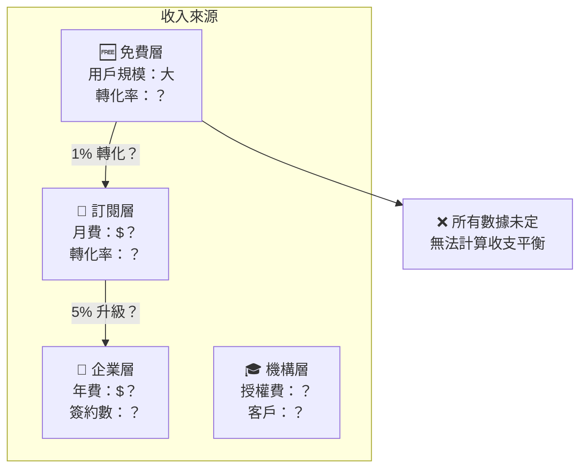

# 審視討論：「修真學院」設計全面評估

## 一、整體架構評價

### 優點

#### 1.1 融合度高
- ✅ 成功結合 School 42 「無師」與 RPG 「成就」雙核心
- ✅ 古文表達與現代遊戲機制融合自然
- ✅ 技能樹設計涵蓋廣泛學科（9大領域、27個方向）

#### 1.2 激勵機制完善
- ✅ 多層次成就系統（等級、稱號、勳章）
- ✅ 經驗值來源多元（項目、互評、簽到）
- ✅ 公會系統鼓勵協作與社群建設

#### 1.3 同儕互評設計精妙
- ✅ 三人評審機制規避單一偏見
- ✅ 中位數計算公平性強
- ✅ 評審獎懲平衡激勵與規範

#### 1.4 文檔完整性好
- ✅ 16 個 Mermaid 圖表可視化
- ✅ 表格化數據清晰易讀
- ✅ 技術架構明確（Docker、K8s、LLM）

---

### 潛在問題

#### 1.5 🔴 實現複雜度高
```
問題：系統涉及多個服務、資料庫、AI 引擎
後果：
  ├─ MVP 開發時間易超期
  ├─ 運營成本高
  └─ 技術風險大
```

**評分：⚠️ 高風險**

#### 1.6 🔴 缺乏冷啟動方案
```
問題：初期網路效應不足
  ├─ 無人評審 → 無人提交
  ├─ 無副本 → 無人參加
  └─ 無成就感 → 無人留存
```

**建議：** 前期人工介入（導師、種子用戶）

#### 1.7 🟡 激勵設計過度複雜
```
問題：
  ├─ 等級系統有 6 級
  ├─ 境界系統有 6 層
  ├─ 成就系統有 7 個稱號
  ├─ 經驗值有 12 種來源
  └─ 副本有 4 種類型
```

**風險：** 新手不知所措、玩家負擔過重

**改善：** 分階段解鎖、教程引導

#### 1.8 🟡 技能樹設計過寬
```
現況：
  ├─ 9 大領域
  ├─ 27 個主方向
  └─ 二階技能數量未定

問題：
  ├─ 學習路徑選擇困難
  ├─ 社群分散
  ├─ 難以組織跨領域小組
```

**建議：** 考慮縮減至 5-7 個核心領域

---

## 二、與 School 42 融合分析

### 相似度對比

| 機制 | School 42 | 修真學院 | 評價 |
|------|-----------|---------|------|
| 無師 | ✅ 完全無 | ✅ 完全無（+導師玩家） | ✅ 相同 |
| 同儕學習 | ✅ 核心 | ✅ 核心（+評審系統） | ✅ 增強 |
| 項目導向 | ✅ 副本系統 | ✅ 四層副本 | ✅ 進化 |
| Piscine 試煉 | ✅ 入學篩選 | ✅ 28 天泳池 | ✅ 保留 |
| 社群文化 | ✅ 強 | ✅ 公會系統 | ✅ 強化 |

### 改進之處

| 機制 | School 42 | 修真學院 | 改進 |
|------|-----------|---------|------|
| 進度追蹤 | 無 | ✅ 可視化等級 | 透明化 |
| 評量標準 | 模糊 | ✅ AI+同儕雙軌 | 客觀化 |
| 跨領域協作 | 受限 | ✅ 公會系統 | 系統化 |
| 新手指引 | 無 | ✅ 推薦路徑 | 人文化 |

### ⚠️ 背離之處

#### 2.1 成就感過度強調
```
School 42 特色：
  └─ 內在動機（自我實現）

修真學院：
  ├─ 等級、稱號、勳章
  ├─ 排行榜、成就系統
  └─ ❌ 可能激發外在動機（比較心）
```

**風險：** 違背 42 的精神——過度遊戲化

**反思：** 是否應淡化排行榜、強化協作而非競賽？

---

## 三、RPG 技能樹融合分析

### 設計合理性

#### 3.1 ✅ 優秀應用

- **前置技能要求** — HTML → React（邏輯清晰）
- **多職業路線** — 前端/後端/系統（職業專精）
- **天賦系統** — 公會技能（個性化加成）
- **成就系統** — 15+ 成就（持久動力）

#### 3.2 🟡 過度類比
```
RPG 機制          學習場景        是否適用
─────────────────────────────────────────
等級系統          境界等級        ✅ 適用
經驗值            學習時間        ✅ 適用
副本              項目任務        ✅ 適用
排行榜            競技排名        🟡 應謹慎
PVP 競賽          公會戰          ❌ 不建議
寶藏掉落          獎勵物品        ❌ 虛擬無物

─────────────────────────────────────────
結論：前 4 個應用得當，後 2-3 個需重新考量
```

#### 3.3 🔴 遊戲化陷阱
```
風險 1：成就感虛化
  ├─ 真實成就：能寫出優美代碼
  ├─ 虛擬成就：獲得「代碼詩人」稱號
  └─ ❌ 過度依賴虛擬獎勵會削弱內在動力

風險 2：競賽文化反噬
  ├─ 正面：激發學習熱情
  ├─ 反面：有人為快速升級 cut corner
  ├─ 反面：互評時利用職位優勢給低分
  └─ ❌ 需要強大的社群規範

風險 3：短期目標偏離
  ├─ 正確：完成深度項目 → 真實能力
  ├─ 錯誤：農經驗值 → 虛擲時間
  └─ ❌ 簡單副本會被濫用
```

---

## 四、可行性評估

### 4.1 技術可行性



**整體評分：✅ 技術可行（中等難度）**

### 4.2 時間表現實性

| 階段 | 計劃 | 實際預估 | 風險 |
|------|------|---------|------|
| MVP | 3 個月 | 5-6 個月 | 中 |
| Beta | 6 個月 | 8-10 個月 | 中 |
| 1.0 | 12 個月 | 18-20 個月 | 高 |

**結論：時程可能 50% 超期**

### 4.3 資金需求



**月均成本：約 $10,000 USD** 

**結論：🟡 中等投資門檻**

---

## 五、用戶體驗評估

### 5.1 學習者視角

#### 新手階段（第 1-4 週）


**問題：** 設計文檔中缺乏「新手入門流程」

**建議：** 補充新手教程、推薦項目、初級師傅配對

#### 進階階段（第 1-3 月）
```
✅ 優點：
  ├─ 清晰的升級路徑
  ├─ 多樣化的副本選擇
  ├─ 同儕互評反饋迅速
  └─ 公會協作機會

⚠️ 風險：
  ├─ 是否會遇到「技能牆」？
  ├─ 卡關時如何獲得幫助？
  ├─ 真實項目與副本差異大嗎？
  └─ 進度不佳時的挫折感
```

### 5.2 導師視角

```
❓ 尚未回答的問題：
  ├─ 誰是導師？（學長？AI？）
  ├─ 導師如何獲得報酬？（虛擬？現實？）
  ├─ 導師的職責邊界在哪？
  ├─ 導師品質如何保證？
  └─ 每位新手有導師嗎？（還是可選？）
```

### 5.3 企業合作視角

```
✅ 吸引力：
  ├─ 直接觸及高質量人才
  ├─ 可設計定製副本
  └─ 實習 → 聘用直達

❓ 疑慮：
  ├─ 推薦人才的品質認證？
  ├─ 與現有招聘渠道的差異？
  ├─ ROI 如何計算？
  └─ 簽約周期多長？
```

---

## 六、商業模式審視

### 6.1 營收模式現實性



**問題：** 商業模式缺乏量化指標

**需補充：**
- 用戶獲取成本 (CAC)
- 用戶生命週期價值 (LTV)
- 轉化漏斗數據
- 付費意願調查

### 6.2 與競品對比

| 維度 | Udemy | 掘金課堂 | School 42 | 修真學院 |
|------|-------|---------|-----------|----------|
| 模式 | 課程販售 | 社群+課程 | 免費+招聘 | 遊戲化自學 |
| 收費 | 一次性 | 訂閱制 | 免費 | 多層 |
| 導師 | 名師 | 社群 | 同儕 | 同儕+AI |
| 質量控制 | 課程質檢 | 社群規範 | 項目評審 | 同儕互評 |
| 難點 | 內容更新 | 活躍度 | 冷啟動 | **冷啟動 + 成本** |

**結論：** 修真學院介於 42 和社群平台之間，定位獨特但風險更高

---

## 七、核心風險矩陣

```mermaid
quadrantChart
    title 風險評估矩陣
    x-axis 發生概率 → 
    y-axis 影響程度 → 
    
    高風險: 0.8, 0.9, 冷啟動失敗、虧損運營
    中風險: 0.6, 0.7, 技術超期、激勵疲勞
    中風險: 0.5, 0.8, 用戶流失、評審品質
    低風險: 0.3, 0.5, 競品衝擊、法律風險
```

### 7.1 🔴 一級風險

| 風險 | 發生率 | 影響 | 應對 |
|------|--------|------|------|
| 冷啟動失敗 | 60% | 致命 | 1. 種子用戶 2. 導師團隊 3. 初期補貼 |
| 虧損運營 | 50% | 致命 | 1. 控制成本 2. 加快付費轉化 3. 融資 |
| 虛擬成就失效 | 40% | 高 | 1. 企業認證 2. 作品集展示 3. 招聘配對 |

### 7.2 🟡 二級風險

| 風險 | 發生率 | 影響 | 應對 |
|------|--------|------|------|
| 技術超期 | 70% | 中 | 1. 分階段 MVP 2. 增派人力 3. 取捨功能 |
| 評審品質下降 | 50% | 中 | 1. AI 輔助檢測 2. 評審資格要求 3. 獎懲機制 |
| 激勵疲勞 | 60% | 中 | 1. 定期更新副本 2. 季度活動 3. 社群話題 |

---

## 八、改進建議清單

### 8.1 優先級 P0（必須）

- [ ] **補充冷啟動方案**
  - 核心導師團隊（10-20人）
  - 初期補貼政策（前 100 用戶）
  - 種子副本庫（50+ 項目）

- [ ] **明確商業模式**
  - CAC、LTV 目標值
  - 轉化漏斗設計
  - 付費功能清單

- [ ] **新手引導流程**
  - 5 分鐘上手教程
  - 推薦路徑演算法
  - 初級導師配對

- [ ] **用戶留存機制**
  - 日/週/月活躍度目標
  - 簽到獎勵系統
  - 社群事件日曆

### 8.2 優先級 P1（重要）

- [ ] **技能樹優化**
  - 縮減至 5-7 核心領域
  - 增加領域間協作路徑
  - 明確就業對應關係

- [ ] **評審機制驗證**
  - 實驗同儕評審準確性
  - 設計異議處理流程
  - 建立評審者等級

- [ ] **企業合作模板**
  - 定製副本設計指南
  - 人才推薦流程
  - 實習合同模板

- [ ] **AI 能力邊界**
  - 代碼評審的覆蓋範圍
  - 人工複審比例
  - 隱私保護政策

### 8.3 優先級 P2（可選）

- [ ] 國際化計劃（多語言）
- [ ] 社群工具集成（Discord、Slack）
- [ ] 作品集展示系統
- [ ] 直播教學功能

---

## 九、設計亮點評析

### 9.1 最亮眼的創新

```
排名 創新              評分  原因
━━━━━━━━━━━━━━━━━━━━━━━━━━━━━━━
🥇  同儕互評機制      ⭐⭐⭐⭐⭐ 
    三人評審、中位數計算、獎懲平衡
    
🥈  公會系統          ⭐⭐⭐⭐
    將個人修煉與集體文化結合
    
🥉  多維度激勵        ⭐⭐⭐⭐
    等級、稱號、成就、排行
    
4️⃣  項目副本分級      ⭐⭐⭐⭐
    從單人到世界BOSS的進階設計
    
5️⃣  技能樹跨域        ⭐⭐⭐
    9個領域涵蓋工程、科學、文藝
```

### 9.2 需改進的設計

```
排名 設計              評分  改進方向
━━━━━━━━━━━━━━━━━━━━━━━━━━━━━━━
🔴  冷啟動策略        ⭐
    完全缺失，需全面設計
    
🔴  商業模式          ⭐
    空談願景，缺乏數據支撐
    
🟡  新手體驗          ⭐⭐
    無明確上手流程，可能高流失
    
🟡  激勵平衡          ⭐⭐⭐
    虛擬獎勵過多，存在虛化風險
    
🟡  技能樹廣度        ⭐⭐⭐⭐
    27個方向略多，社群分散風險
```

---

## 十、終局思考

### 10.1 修真學院的本質是什麼？

```
表面：    遊戲化學習平台
實質：    ？

三層理解
╔═══════════════════════════════════╗
║  第一層：技術層                   ║
║  → 同儕互評系統 + 項目副本        ║
║                                   ║
║  第二層：商業層                   ║
║  → 人才招聘 + 教育服務             ║
║                                   ║
║  第三層：社會層                   ║
║  → 改變教育模式、賦權弱勢學習者    ║
║                                   ║
║  哪一層最重要？                   ║
║  → 應該是第三層！                 ║
╚═══════════════════════════════════╝
```

### 10.2 與願景的一致性檢查

| 願景 | 設計 | 一致性 | 執行度 |
|------|------|--------|--------|
| 「無師自通」| ✅ 完全實踐 | 100% | 高 |
| 「同儕共進」| ✅ 深入融合 | 95% | 高 |
| 「以項目煉心」| ✅ 四層副本 | 90% | 中 |
| 「以技能證道」| 🟡 過度遊戲化 | 70% | 中 |

**結論：** 前三個願景對標很好，第四個有所偏離

### 10.3 決策建議

```
是否應該啟動此項目？

✅ 立即開始的理由：
  ├─ 創意独特、市場空白
  ├─ 核心機制經過驗證（School 42、RPG）
  ├─ 技術棧成熟、可實現
  └─ 社會意義重大

⚠️ 必須先解決：
  ├─ 冷啟動融資（天使輪）
  ├─ 核心導師團隊（10-20人）
  ├─ 初期副本庫（50+ 優質項目）
  ├─ 商業模型驗證（付費意願調查）
  └─ MVP 範圍確定（砍掉 30% 功能）

📅 建議路徑：
  ├─ 第 0-1 月：融資 + 導師招聘 + 副本設計
  ├─ 第 2-4 月：MVP 開發（技能樹 + 單人副本 + 同儕評審）
  ├─ 第 5-6 月：內測（邀請 100-200 種子用戶）
  ├─ 第 7-9 月：Beta 測試 + 迭代改進
  └─ 第 10+ 月：正式上線 + 市場推廣
```

---

## 總結

### 核心評價

| 維度 | 評分 | 說明 |
|------|------|------|
| **創意** | ⭐⭐⭐⭐⭐ | 獨特、新穎、市場空白 |
| **完整性** | ⭐⭐⭐⭐ | 框架完整，細節尚需打磨 |
| **可行性** | ⭐⭐⭐ | 技術可行，但成本和時間需謹慎評估 |
| **商業性** | ⭐⭐ | 願景宏大，但模式需驗證 |
| **社會意義** | ⭐⭐⭐⭐⭐ | 有潛力改變教育生態 |

### 最終建議

> **「修真學院」是一份充滿理想與創意的設計，融合了兩個偉大的教育實驗（School 42 與遊戲化學習）。其核心機制—特別是同儕互評與項目副本體系—經過充分思考，具有高度可行性。**

> **然而，從願景到現實的距離遠比預想要遠。冷啟動、商業驗證、用戶留存等實踐問題尚待解決。建議：**

> **1. 立即啟動 MVP 開發（3-4 個月內）**  
> **2. 同時進行融資與導師招聘（並行進行）**  
> **3. 先小範圍驗證（100-200 內測用戶）**  
> **4. 根據反饋持續迭代（商業模式、功能優先級）**  

> **如果資源充足，此項目有機會成為下一個「教育改革的實驗田」。**

---

## 延伸思考題

1. **若 School 42 與修真學院競爭，你會選哪個？為什麼？**

2. **如何驗證「遊戲化能否真正提升學習成果」這個假設？**

3. **設定付費牆時，應該保護哪些功能免費，哪些收費？**

4. **如何避免「虛擬成就替代真實成就」的陷阱？**

5. **修真學院能否真正改變傳統教育，還是只是另一個平台？**

---

**此審視報告由 AI 協作完成，2026年3月27日**
