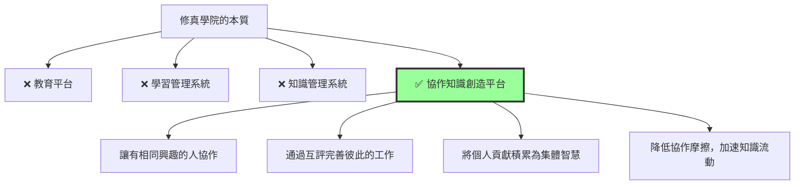
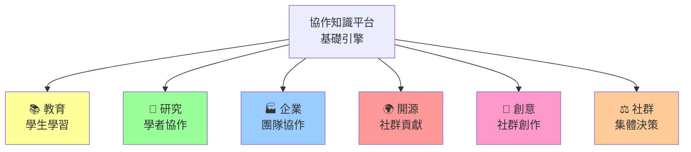
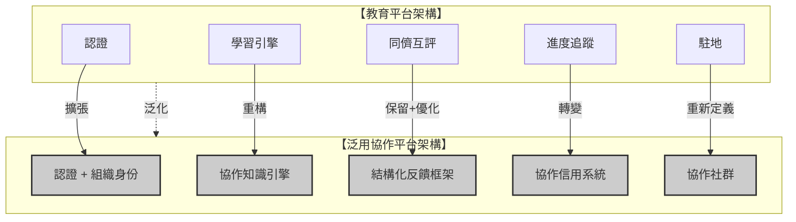
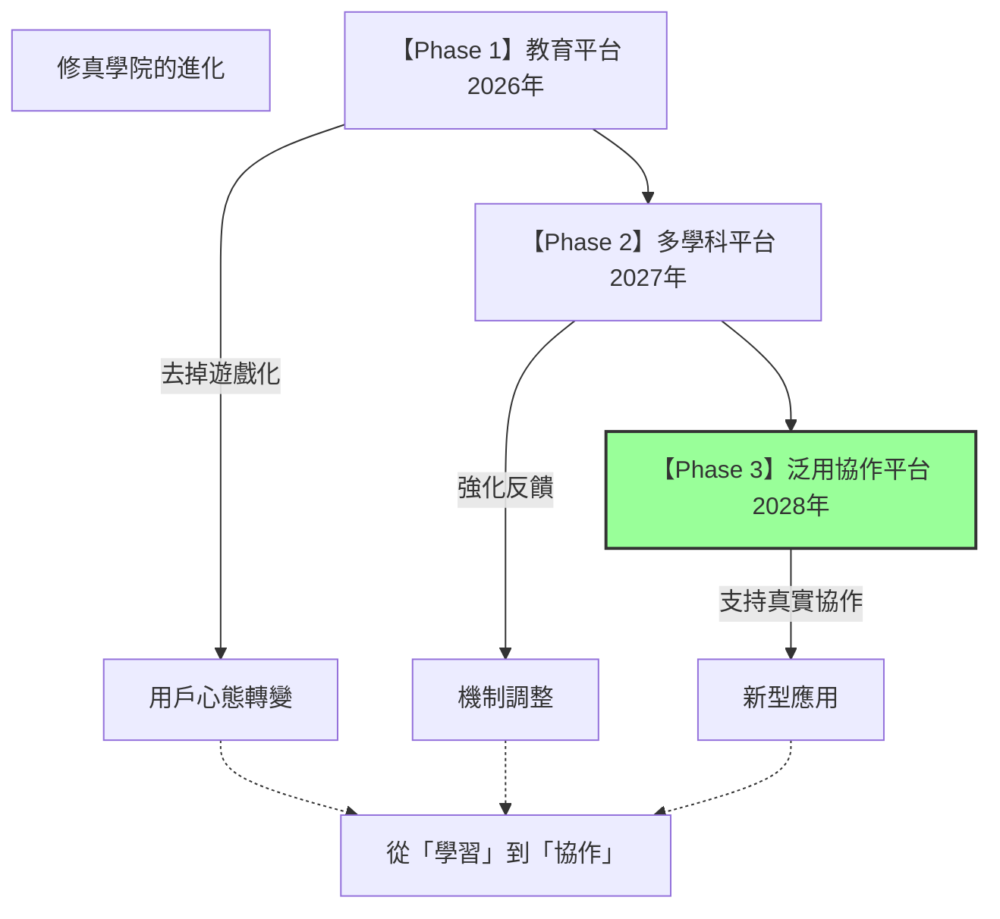

# 從「教育平台」到「泛用協作知識平台」

> 「教育不過其一用途，真實所需乃協作之道，知識共創之法。」

---

## 壹、核心洞察：什麼是真正的本質？

### 修真學院的「教育性」假設

```
當前假設（教育平台視角）
  ├─ 用戶：學習者
  ├─ 目標：掌握知識與技能
  ├─ 核心動力：內在學習動機
  ├─ 成功指標：能力進步
  └─ 場景：課堂、自學、培訓

問題：這些假設是必要的嗎？
```

### 更深層的本質



**核心發現：** 修真學院的機制本質上是**「協作框架」**，而非「教育框架」

---

## 貳、泛化到非教育領域

### 可能的應用場景



---

### 場景一：學術研究協作

```
【從教育→研究】

⚙️ 核心機制的遷移
  
  教育版本：
    提交代碼 → AI 檢測 → 同儕互評 → 獲得成就
  
  研究版本：
    提交論文 → AI 檢測 → 同行評審 → 發表認可

❌ 需要改變的
  ├─ 「成就系統」改為「發表系統」
  ├─ 「項目」改為「研究論文」
  ├─ 「駐地」改為「研究社群」
  └─ 「三維進度」改為「學術影響力」

✅ 保留的通用機制
  ├─ 同儕評審框架
  ├─ 結構化反饋
  ├─ 署名責任制
  ├─ 對話反饋循環
  └─ 協作信用系統
```

#### 具體設計

```
【學術研究駐地】

通用機制的直接應用：

📝 同儕評審
  研究者提交論文 → 5 位同行評審 → 結構化反饋
  
  反饋維度：
    ✓ 研究創新性
    ✓ 方法學嚴謹性
    ✓ 論文撰寫清晰度
    ✓ 實驗可重複性

💡 對話反饋循環
  作者看到評審後 → 與評審者線上對話 → 修改論文 → 評審者確認改進
  
  內在激勵：
    作者：「評審者看到我的改進」→ 被認可
    評審者：「我的建議幫助了他們」→ 被需要

⭐ 協作信用
  維度一：論文發表數量 + 被引用次數
  維度二：評審品質（被評者評分 + 後續論文驗證評論正確性）
  維度三：社群認可（同行推薦他為「可信評審者」）

🏆 去掉的「教育特定」機制
  ❌ 成就系統（不需要虛擲勳章）
  ❌ 等級系統（學位本身就是資格認證）
  ❌ 初級 vs 進階區分（研究沒有「初級」）
```

---

### 場景二：開源軟體協作

```
【從教育→開源社群】

⚙️ 核心機制的遷移
  
  教育版本：
    提交代碼 → AI 檢測 → 同儕互評 → 升級
  
  開源版本：
    提交 PR → 自動測試 → 社群評審 → 合併主分支

✅ 完全相同的核心機制
  ├─ 同儕評審（代碼審閱）
  ├─ 結構化反饋（審查評論）
  ├─ 署名責任制（真名評審）
  ├─ 對話反饋（修改迭代）
  └─ 協作信用（貢獻者聲譽）

❌ 需要重點調整
  ├─ 移除「成就系統」
  ├─ 移除「等級系統」
  ├─ 強化「實際代碼影響力」
  ├─ 整合 GitHub 作為作品集
  └─ 側重「真實生產環境」而非「學習環境」
```

#### 具體設計

```
【開源社群駐地】

通用機制的應用 + 特化：

🔄 代碼評審循環
  貢獻者提交 PR → 維護者評審 → 自動化測試
  
  評審內容：
    ✓ 代碼風格一致性
    ✓ 性能影響
    ✓ 安全性
    ✓ 文檔完整性
    
  評審後對話：
    維護者：「性能有問題，可以這樣改...」
    貢獻者：「我試試你的建議」
    維護者：「好的，我看到改進了」

👥 社群角色流動性
  新手 → 貢獻者 → 活躍貢獻者 → 維護者 → 決策委員會
  
  注意：
    • 非基於時間的升級
    • 基於實際貢獻的角色變化
    • 可以退出（無懲罰）
    • 允許橫向移動（換個領域）

💝 協作信用系統
  維度一：代碼質量（被接納的 PR 數、代碼被使用情況）
  維度二：評審品質（評審被感謝、後續被證實正確）
  維度三：社群影響（文檔、教程、倡導者）
  
  最終表現：
    • GitHub 檔案展示
    • 開源履歷
    • 職業認可

🏆 去掉的元素
  ❌ 排行榜（開源本身不是競賽）
  ❌ 稱號和勳章（代碼說話）
  ❌ 虛擲激勵（實際 PR 合併即為最大激勵）
```

---

### 場景三：企業團隊協作

```
【從教育→企業內部】

⚙️ 核心機制的遷移
  
  教育版本：
    學生提交作業 → AI 反饋 → 同儕互評 → 學習進度
  
  企業版本：
    員工提案 → AI 檢測 → 跨部門評審 → 執行決策

✅ 通用機制
  ├─ 結構化反饋（提案評論）
  ├─ 多視角評審（跨部門視點）
  ├─ 對話迭代（提案修改）
  └─ 協作信用（評審品質、提案採納率）

❌ 需要大幅調整
  ├─ 增加「組織層級」維度
  ├─ 整合「決策權限」系統
  ├─ 連接「預算系統」
  ├─ 追蹤「執行進度」
  ├─ 測量「實際影響」
  └─ 移除遊戲化元素（公司不需要排行榜）
```

#### 具體設計

```
【企業創新駐地】

用案例說明：

🎯 員工創新提案流程

  1️⃣ 提案提交
     員工提交創新想法
     內容：問題、解決方案、預期成果、所需資源
  
  2️⃣ 多角色評審
     ├─ 技術主管：可行性評審
     ├─ 財務主管：預算可行性
     ├─ 用戶部門：實際需求
     ├─ 跨部門代表：其他視角
     └─ CEO/創新官：戰略對齊
     
     評審結構：
       ✓ 為什麼這個提案有價值
       ? 需要改進的地方
       💡 啟發式問題

  3️⃣ 對話迭代
     提案者看到評審 → 與評審者討論 → 修改提案 → 重新評審
     
     可能結果：
       ✓ 批准並立項
       ✓ 批准但需縮小範圍
       ✓ 暫緩（等待時機）
       ✓ 不批准但反饋有價值

  4️⃣ 執行追蹤
     若批准，進入「執行面板」
     ├─ 預算跟蹤
     ├─ 進度更新
     ├─ 阻礙識別
     └─ 成果測量

  5️⃣ 事後評估
     項目完成後
     ├─ 實際成果 vs 預期
     ├─ 實際成本 vs 預算
     ├─ 參與者的學習收穫
     └─ 提案者獲得「成功創新者」信用

協作信用（企業版）
  維度一：提案品質（採納率、成果達成度）
  維度二：評審品質（評審被感謝、評審意見後來被證實價值）
  維度三：執行能力（承諾交付、協作態度）
  
  應用場景：
    • 晉升考量
    • 跨部門調動
    • 特殊項目負責人選擇
    • 薪酬評估

🏆 去掉或調整的
  ❌ 完全去掉成就系統（公司無需虛擲）
  ✏️ 調整等級系統 → 組織層級系統
  ✏️ 調整評審權限 → 基於職位的決策權
  ✏️ 調整激勵 → 實際薪酬、晉升、認可
```

---

### 場景四：開源知識社群

```
【從教育→維基百科式社群】

⚙️ 核心機制的遷移
  
  教育版本：
    學生寫論文 → 同儕評審 → 完成項目 → 成就
  
  知識社群版本：
    貢獻者編輯條目 → 社群評審 → 持續改進 → 知識積累

✅ 通用機制
  ├─ 同儕評審（條目編輯評審）
  ├─ 結構化反饋（編輯評論）
  ├─ 對話迭代（編輯修改）
  ├─ 版本歷史（追蹤貢獻者）
  └─ 協作信用（編輯活動度、品質）

❌ 特殊需求
  ├─ 條目版本控制（非線性演進）
  ├─ 協議制定（什麼是「好的條目」）
  ├─ 審慎的權限管理（防止破壞）
  ├─ 長期的維護機制
  └─ 知識的中立性審查
```

---

## 叁、泛化後的平台架構

### 從「教育引擎」到「協作引擎」



### 核心層的泛化

#### 層一：認證 + 組織身份

```
【教育版】
  用戶 → 個人檔案 → 進度可見

【泛用版】
  用戶 → 個人檔案 + 組織身份
  
  個人檔案：
    • 名字、頭像
    • 興趣領域
    • 協作信用系統
    • 公開作品集
  
  組織身份：
    • 所屬企業/機構/社群
    • 在該組織的角色
    • 組織內的權限級別
    • 組織特定的成就
  
  示例：
    小李
    ├─ 個人層級
    │   ├─ 開源貢獻者（200+ PR）
    │   ├─ 學術研究者（發表 5 篇論文）
    │   └─ 信用評分 4.8/5.0
    │
    └─ 組織層級
        ├─ 騰訊（高級工程師，創新評審員）
        ├─ Apache（維護者）
        ├─ CUHK（博士候選人）
        └─ 開源中國（版主）
```

#### 層二：協作知識引擎（而非「學習引擎」）

```
【教育版】
  項目 → 提交 → 評審 → 完成 → 進度 + 成就

【泛用版】
  工作 → 提交 → 評審 → 迭代 → 真實成果
  
  工作類型（通用）：
    • 代碼 PR（開源）
    • 研究論文（學術）
    • 創新提案（企業）
    • 編輯條目（知識社群）
    • 設計方案（創意）
    • 決策提議（治理）

  通用的評審流程：
    提交 → 結構化反饋 → 對話迭代 → 最終決策 → 真實影響追蹤
```

#### 層三：結構化反饋框架（通用）

```
【任何場景都適用的評審結構】

✓ 做得好的地方
  [具體例子與讚賞]

? 需要改進的地方
  [具體問題 + 改進方向]

💡 啟發性問題
  [開放式問題，促進思考]

🔗 推薦資源或連結
  [相關信息或協作機會]

【最重要的：署名而非隱名】
  評審者名字清晰可見
  └─ 建立個人信用
  └─ 承擔責任
  └─ 鼓勵認真評審
```

#### 層四：協作信用系統（而非「成就系統」）

```
【教育版】
  成就系統：「築網者」「代碼詩人」「跨界真人」等虛擲勳章

【泛用版】
  協作信用系統（多維度，真實可驗證）：
  
  維度 1：貢獻品質
    • 工作被採納率
    • 完成度
    • 被引用/被使用情況
    └─ 量化指標：採納率 85%、被使用 100+ 次

  維度 2：評審品質
    • 評審被感謝次數
    • 評審意見的準確性（事後驗證）
    • 評審者被「追蹤」人數
    └─ 量化指標：評審滿意度 4.7/5.0、被追蹤 50 人

  維度 3：協作態度
    • 對話品質
    • 回應速度
    • 社群貢獻
    └─ 量化指標：平均回應時間 4 小時、幫助他人 30+ 次

  維度 4：影響力
    • 已發表/已發佈作品數
    • 社群認可度（同行推薦）
    • 下游依賴者數量
    └─ 量化指標：發表 15 篇、被推薦 10 次、使用者 1000+

  呈現方式：
    不是虛擲的「徽章」，而是「可驗證的聲譽檔案」
    
    小李的協作檔案
    ├─ 貢獻品質 ████████░░ 81%（發表 15 篇論文，被引 120+）
    ├─ 評審品質 █████████░ 91%（評審 50 次，滿意度 4.7/5）
    ├─ 協作態度 ██████████ 100%（平均回應 2 小時）
    └─ 影響力  ███████░░░ 73%（被 8 人推薦，引用 45 次）
    
    總評：可信協作者，擅長論文評審與學術互動
```

#### 層五：協作社群（而非「駐地」）

```
【教育版】
  駐地：興趣相同的學習者聚集
  特點：平等、開放、流動、新手友善

【泛用版】
  協作社群：志同道合的工作者聚集
  特點：
    • 有明確的使命/方向
    • 工作導向而非學習導向
    • 角色流動且有責任
    • 成果導向的評估
    • 更複雜的決策機制

  比較：
    教育駐地               協作社群
    ├─ 歡迎新手            ├─ 門檻適當
    ├─ 鼓勵嘗試            ├─ 期望品質
    ├─ 容錯度高            ├─ 容錯度適中
    ├─ 平等決策            ├─ 責任決策
    └─ 社交為先            └─ 工作為先

  案例對比：
    教育駐地例：「Python 初學者駐地」
      50+ 新手一起學習 Python
      沒有對錯，只有互相幫助
    
    協作社群例：「CPython 開發社群」
      核心 10 人維護者
      新的 PR 需要通過評審
      有決策權限和責任
```

---

## 肆、需要移除或調整的教育特定機制

### 完全移除

```
❌ 成就/勳章系統
  原因：
    • 企業/開源/研究中無需虛擲
    • 實際成果（代碼、論文、產品）就是最好的成就
    • 反而會誘導人為升級或虛擲

❌ 排行榜
  原因：
    • 教育環境可能需要激勵，但協作中有害
    • 轉向競爭而非合作
    • 開源、研究、企業都不鼓勵排名文化

❌ 等級系統（Lv.1-MAX）
  原因：
    • 教育中用來追蹤進度
    • 在真實協作中，實際角色（維護者、研究者、主管）更重要
    • 虛擲等級與實際權力/責任脫節

❌ 初級/進階/實戰的分級
  原因：
    • 教育中用來引導學習路徑
    • 在開源/企業/研究中，工作本身就是「實戰」
    • 無需人為分層
```

### 大幅調整

```
🔄 「三維度進度」→ 「多維協作信用」

  教育版：
    知識掌握度（0-100%）
    項目完成度（完成的數量）
    同儕認可度（推薦、讚賞）

  泛用版：
    貢獻品質（採納率、使用率）
    評審品質（滿意度、準確性）
    協作態度（回應、互助）
    影響力（下游依賴、社群認可）
    └─ 更複雜但更真實

🔄 「對話式互評」→ 「責任制同行評審」

  教育版：
    署名評審，鼓勵深度反饋
    目的：幫助學習者改進

  泛用版：
    署名評審 + 責任制
    目的：確保工作品質
    機制：評審者要為評審內容負責
    └─ 若評審不當，評審者信用受損

🔄 「興趣駐地」→ 「協作社群」

  教育版：
    51 人、平等決策、流動角色
    新手友善、容錯度高

  泛用版：
    規模可變、責任決策、明確角色
    貢獻門檻、容錯度適中
    └─ 更結構化、更工作導向
```

---

## 伍、新增的泛用協作需求

### 組織層級系統

```
【企業/開源/研究都需要的】

角色系統（流動但有責任）
  • 貢獻者：提交工作
  • 評審者：評審工作
  • 維護者：決策與管理
  • 決策委員會：戰略方向

權限系統
  • 誰可以合併代碼
  • 誰可以發表論文
  • 誰可以批准提案
  • 誰可以設置規則

透明度系統
  • 決策過程公開
  • 評審紀錄可見
  • 分歧如何解決
  • 上訴機制
```

### 流程管理系統

```
【非教育場景必需】

工作流追蹤
  提交 → 評審 → 修改 → 再審 → 批准 → 執行 → 驗收

狀態管理
  • 草稿
  • 評審中
  • 需改進
  • 批准待執行
  • 執行中
  • 完成
  • 事後評估

里程碑與截止日期
  • 不像教育（無期限或彈性期限）
  • 真實協作需要時間管理

衝突解決機制
  • 評審者意見不一致？
  • 提案被拒後如何上訴？
  • 誰是最終決策者？
```

### 知識資產管理

```
【真實協作的附加需求】

版本管理
  • 工作的演進歷史
  • 為什麼做出了改變
  • 可以回滾嗎

智慧財產權
  • 誰擁有貢獻的代碼/論文/想法
  • 使用許可（開源協議、版權）
  • 歸屬如何標明

可搜索性與發現
  • 這個已經有人做過嗎
  • 相關的已完成工作在哪
  • 可以復用嗎
```

### 成果測量系統

```
【教育中無需，協作中必須】

實際影響追蹤
  代碼 → 代碼被下載/使用情況
  論文 → 論文被引用、被複現
  提案 → 執行成果 vs 預期

ROI 計算
  花了多少成本（人力、金錢）
  得到了什麼回報（產品、知識、名聲）

問責制
  誰對最終結果負責
  結果不達預期時如何處理
  失敗是學習機會還是問題
```

---

## 陸、新的平台定位

### 從「教育」到「協作」的轉變



### 新的使命宣言

```
【原使命】
  「讓每個學習者都能被看見、被認可、能幫助他人」

【新使命】
  「降低協作摩擦，加速知識與創意的流動與碰撞」
  
  更具體：
    ✓ 提供通用的協作框架
    ✓ 無論領域和規模
    ✓ 強化對話與反饋
    ✓ 讓真實成果可見且可驗證
    ✓ 建立基於信用而非虛擲的激勵
```

---

## 柒、具體的遷移計劃

### 第一階段：架構準備（1-2 個月）

```
目標：從教育引擎重構為協作引擎

❌ 移除或淘汰
  ├─ 成就/勳章系統
  ├─ 排行榜
  ├─ 等級系統
  ├─ 初級/進階分層
  └─ 所有遊戲化元素

✏️ 改造和升級
  ├─ 三維度進度 → 多維協作信用
  ├─ 駐地 → 協作社群
  ├─ 用戶檔案 → 用戶檔案 + 組織身份
  ├─ 同儕互評 → 責任制同行評審
  └─ 進度追蹤 → 工作流管理

✨ 新增系統
  ├─ 角色與權限管理
  ├─ 流程管理
  ├─ 版本控制
  ├─ 成果測量
  └─ 衝突解決機制
```

### 第二階段：試點應用（2-3 個月）

```
目標：在非教育領域驗證新架構

試點場景
  ① 開源社群（GitHub 集成）
  ② 學術研究（論文管理）
  ③ 小型企業（提案管理）
  ④ 維基百科式知識社群

評估指標
  ✓ 協作流暢度（評審時間、迭代次數）
  ✓ 決策品質（最終成果滿意度）
  ✓ 用戶滿意度（相比原有工具的優勢）
  ✓ 適用性（是否泛化成功）
```

### 第三階段：全面擴張（3+ 個月）

```
目標：建立真正的泛用協作平台

擴張領域
  ├─ 政府/NGO（決策制定、社區決策）
  ├─ 藝術創作（集體創作、策展）
  ├─ 新聞/媒體（編輯流程、事實檢查）
  ├─ 法律/政策（集體法規制定）
  └─ 城市規劃（社區參與決策）

新型應用
  ├─ 去中心化治理（DAO）
  ├─ 眾包研究
  ├─ 開放式創新
  ├─ 社區決策平台
  └─ 集體智慧工具
```

---

## 捌、泛用協作平台的新應用想像

### 政策制定

```
【例：城市規劃決策】

傳統流程：
  政府 → 專家 → 決策 → 執行（公眾無聲音）

修真學院版本：
  政府提出規劃提案
  ↓
  建築師、環保人士、居民等多方評審
  ├─ 建築師：「這個設計可行」
  ├─ 環保人士：「需要考慮綠化」
  └─ 居民：「我們希望多一些停車位」
  ↓
  政府回應評審意見、修改提案
  ↓
  第二輪評審
  ↓
  最後投票決策
  ↓
  執行過程中實時反饋
  ↓
  事後評估

特點：
  ✓ 透明的決策過程
  ✓ 多元聲音被聽見
  ✓ 可追蹤的討論歷史
  ✓ 責任可追究
```

### 眾包研究

```
【例：流行病防控研究】

傳統模式：
  單個研究團隊 → 論文 → 同行評審 → 發表
  缺點：耗時 18 個月，全球知識無法快速共享

修真學院版本：
  全球研究者提交新發現
  ↓
  全球同行實時評審
  ├─ 這個實驗設計對嗎
  ├─ 數據解釋合理嗎
  ├─ 有其他解釋嗎
  └─ 我的實驗也發現了相同現象
  ↓
  集體共識快速形成
  ↓
  真實影響（政策制定者可以看到強共識）

特點：
  ✓ 實時協作而非串行流程
  ✓ 全球知識快速匯聚
  ✓ 透明的論證過程
  ✓ 加速人類應對危機的速度
```

### 去中心化治理（DAO）

```
【例：開源基金會 DAO】

利用修真學院的協作平台：

決策流程：
  提案提交 → 社群評審 → 對話迭代 → 投票 → 執行 → 驗收

信用系統支持：
  ✓ 投票權可基於貢獻度
  ✓ 決策者可追蹤
  ✓ 承諾可驗證
  ✓ 結果可審計

成果：
  透明、去中心化、群體智慧驅動的治理
```

---

## 玖、新的商業價值

```mermaid
graph TD
    A["泛用協作平台的價值"]
    
    B["降低協作成本"]
    B1["減少溝通摩擦"]
    B2["加速決策速度"]
    B3["提高決策品質"]
    
    C["加速知識流動"]
    C1["打破信息孤島"]
    C2["跨域知識碰撞"]
    C3["創新加速"]
    
    D["建立信用系統"]
    D1["可驗證的能力"]
    D2["透明的協作歷史"]
    D3["便於人才發現"]
    
    E["新型應用機會"]
    E1["政府決策支持"]
    E2["企業協作 SaaS"]
    E3["去中心化治理"]
    E4["眾包研究平台"]
    
    A --> B & C & D & E
    
    style B fill:#9f9,stroke:#333,stroke-width:2px
    style C fill:#9cf,stroke:#333,stroke-width:2px
    style D fill:#ff9,stroke:#333,stroke-width:2px
    style E fill:#f9c,stroke:#333,stroke-width:2px
```



---

## 拾、保留的核心機制

### 什麼是真正的通用本質

```
✅ 永遠保留的核心機制
  
  1️⃣ 結構化反饋框架
     ├─ 不依賴領域
     ├─ 保證反饋品質
     └─ 適用於任何協作場景
  
  2️⃣ 署名責任制
     ├─ 評審者要負責任
     ├─ 建立個人信用
     └─ 鼓勵認真態度
  
  3️⃣ 對話反饋循環
     ├─ 提案者和評審者溝通
     ├─ 深化理解而非單向評判
     └─ 追蹤改進過程
  
  4️⃣ 多角色評審
     ├─ 不同視角評審
     ├─ 降低盲點
     └─ 提高決策品質
  
  5️⃣ 協作信用追蹤
     ├─ 可驗證的聲譽
     ├─ 真實成果記錄
     └─ 基於信用而非虛擲
  
  6️⃣ 開放協作社群
     ├─ 吸引有志者
     ├─ 流動角色
     └─ 共同使命
```

---

## 拾壹、總結：泛用化的關鍵調整

### 對標表

| 維度 | 教育平台版 | 泛用協作平台版 | 變化 |
|------|----------|------------|------|
| **使命** | 促進學習 | 加速協作 | 從個人成長 → 協作成果 |
| **用戶** | 學習者 | 協作者 | 擴大到所有領域 |
| **激勵** | 內在學習動機 | 實際成果 + 聲譽 | 從虛擲 → 真實價值 |
| **成就** | 勳章、稱號、等級 | 協作信用系統 | 移除遊戲化 |
| **進度** | 能力三維度 | 協作信用多維度 | 更複雜、更真實 |
| **流程** | 項目 → 評審 → 完成 | 工作 → 評審 → 迭代 → 決策 → 執行 → 驗收 | 增加決策和驗收環節 |
| **角色** | 平等駐地 | 層級社群 | 有責任和權限差異 |
| **時間** | 彈性 | 截止日期 | 更嚴格的時間管理 |
| **責任** | 低 | 高 | 評審者、決策者要負責 |
| **透明度** | 中 | 高 | 決策過程全部可見 |
| **應用** | 教育領域 | 全領域 | 政府、企業、開源、研究等 |

---

## 拾貳、最終願景

```
修真學院的終極進化：

【Phase 1：教育實驗】
  2026 年 - 編程 + 多學科教育平台

【Phase 2：協作平台】
  2027 年 - 泛用協作基礎設施

【Phase 3：社會基礎設施】
  2030+ 年 - 所有協作活動的首選平台
  
  應用場景：
    ├─ 企業內部協作
    ├─ 開源社群建設
    ├─ 學術研究協力
    ├─ 政府決策制定
    ├─ 城市規劃參與
    ├─ NGO 志工協作
    ├─ 社區治理
    └─ 去中心化治理（DAO）

【終極目標】
  建立一個「協作OS」
  
  就像 Windows/macOS 是個人電腦的操作系統
  修真學院是「協作活動」的操作系統
  
  特點：
    ✓ 通用的協作框架
    ✓ 可適配任何領域
    ✓ 內置信用系統
    ✓ 基於真實成果
    ✓ 透明可追溯
    ✓ 去中心化治理

  最大的價值：
    降低人類協作的摩擦
    加速知識與創意的流動
    讓集體智慧更容易浮現
```

---

> **修真學院的本質不在教育，而在協作。**
> 
> **每一次有意義的人類活動——無論學習、研究、工作、創新、治理——**
> **本質上都是協作。**
> 
> **而修真學院要做的，**
> **是建立協作的基礎設施。**
> 
> **從教育開始，但絕不止於教育。**

---

**此文檔專注於：從教育平台到泛用協作平台的體系化遷移方案。**
